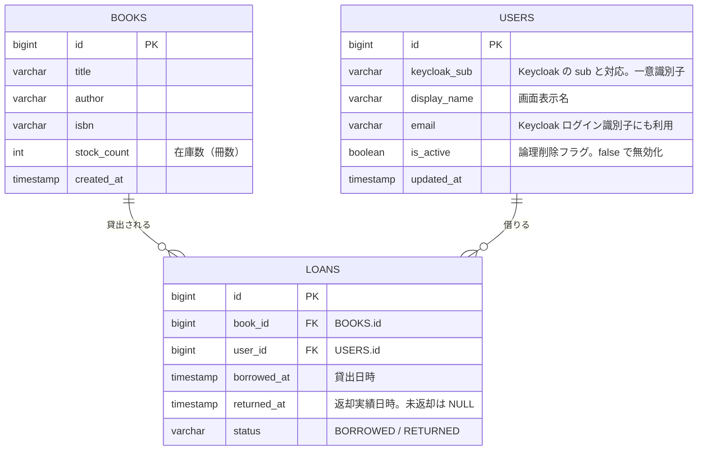

# ER 図

このドキュメントは、LibraShare の MVP-A における確定済み DB スキーマの ER 図です。認証・ロール管理の正は Keycloak とし、アプリ DB の `users` は貸出対象の利用者（`general_user`）のみを参照情報として保持します。社員・管理社員は `users` に登録せず Keycloak で管理します。

参照元は [README.md](README.md) の「DB スキーマ（MVP-A）」です。

## エンティティ関連図

## リレーション

| 関係 | カーディナリティ | 説明 |
|------|------------------|------|
| `BOOKS` — `LOANS` | 1 対 0..N | 1 冊の本は複数の貸出履歴を持つ |
| `USERS` — `LOANS` | 1 対 0..N | 1 利用者は複数の貸出履歴を持つ |

`loans` は `book_id` / `user_id` を外部キーに持ち、「誰がいつどの本を借りたか」を記録する履歴テーブルです。

## 補足

- `users` は貸出対象の利用者（`general_user`）のみを保持する参照テーブルです。認証・パスワード・ロールの正は Keycloak です。社員・管理社員は `users` に含めず、Keycloak コンソールで管理します。
- 付与ロールは常に `general_user` のため `users` に `role` カラムは持ちません。ロール判定は JWT で行います。
- アプリ DB は独自の `username` を持たず、表示は `display_name`、一意識別は `keycloak_sub` で行います。Keycloak のログイン識別子には `email` を用いる想定です。
- 利用者削除は物理削除ではなく、`is_active=false` による論理削除 + Keycloak 無効化で行います。過去の `loans` 履歴は保持します。
- `loans.returned_at` は返却された実績日時で、`status` と対応します（貸出中は NULL）。返却予定日 `due_at` は MVP-A のスコープ外です。
- 型は PostgreSQL 前提です。`varchar` は長さ制約を意図した表記で、実装時に各カラムの最大長を定めます。
- 延滞管理（`due_at` / `overdue_at`、`OVERDUE` ステータス）などの拡張は [docs/future-considerations.md](docs/future-considerations.md) を参照してください。
