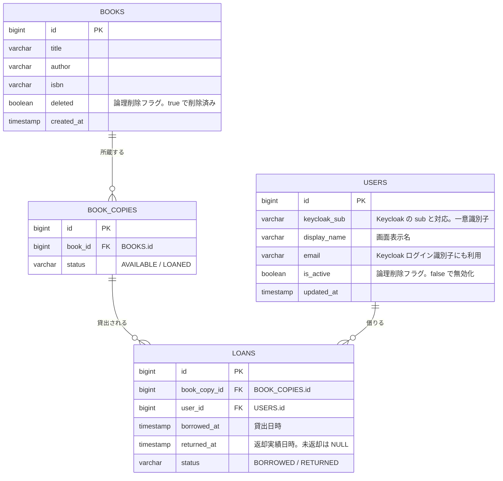

# ER 図

このドキュメントは、LibraShare の MVP-A における確定済み DB スキーマの ER 図です。認証・ロール管理の正は Keycloak とし、アプリ DB の `users` は貸出対象の利用者（`general_user`）のみを参照情報として保持します。社員・管理社員は `users` に登録せず Keycloak で管理します。

書誌と所蔵の分離・一括貸出の確定方針は [refactor-holdings-and-checkout.md](./refactor-holdings-and-checkout.md) を参照してください。参照元は [README.md](../README.md) の「DB スキーマ（MVP-A）」です。

## エンティティ関連図



## リレーション

| 関係 | カーディナリティ | 説明 |
|------|------------------|------|
| `BOOKS` — `BOOK_COPIES` | 1 対 0..N | 1 書誌は複数の所蔵（物理冊）を持つ |
| `BOOK_COPIES` — `LOANS` | 1 対 0..N | 1 所蔵は複数の貸出履歴を持つ |
| `USERS` — `LOANS` | 1 対 0..N | 1 利用者は複数の貸出履歴を持つ |

`loans` は `book_copy_id` / `user_id` を外部キーに持ち、「誰がいつどの所蔵を借りたか」を記録する履歴テーブルです。

貸出可能冊数は `books` に保持せず、`COUNT(book_copies WHERE book_id=? AND status='AVAILABLE')` で集計します。`barcode` / `location` は MVP-A では持たない。

## 制約（MVP-A の決定事項）

### 外部キー（参照整合性）

- `book_copies.book_id` → `books.id`
- `loans.book_copy_id` → `book_copies.id`
- `loans.user_id` → `users.id`

参照アクションは **物理削除をしにくくし、履歴を壊さない** 方針とし、次を採用します。

- **ON DELETE**: `RESTRICT`（または `NO ACTION`）
- **ON UPDATE**: `RESTRICT`（または `NO ACTION`）

補足:

- `books` は物理削除ではなく **論理削除（`deleted=true`）** を正とします。貸出履歴を壊さないため行は残します。通常の一覧・詳細は `deleted=false` のみを対象とします。書誌削除時、紐づく所蔵に `LOANED` があれば削除不可（業務 409）。
- `users` は物理削除ではなく **論理削除（`is_active=false`）** を正とします（変更なし）。

### CHECK（整合性）

- `book_copies.status IN ('AVAILABLE', 'LOANED')`
- `loans.status IN ('BORROWED', 'RETURNED')`
- `loans.status='BORROWED'` のとき `returned_at IS NULL`
- `loans.status='RETURNED'` のとき `returned_at IS NOT NULL`
- `returned_at IS NULL OR returned_at >= borrowed_at`

### UNIQUE（推奨）

- `users.keycloak_sub` は UNIQUE
- `users.email` は UNIQUE（Keycloak のログイン識別子にも利用する想定のため）

### 索引（決定）

- `book_copies(book_id)`
- `loans(book_copy_id)`
- `loans(user_id)`

## テーブル作成 SQL（PostgreSQL・到達スキーマ）

実装時は既存 `stock_count` / `loans.book_id` から Flyway で移行する。以下は移行完了後の到達形です。

```sql
-- books（書誌。stock_count は持たない）
CREATE TABLE IF NOT EXISTS books (
  id BIGINT GENERATED ALWAYS AS IDENTITY PRIMARY KEY,
  title VARCHAR(255) NOT NULL,
  author VARCHAR(255) NOT NULL,
  isbn VARCHAR(32),
  deleted BOOLEAN NOT NULL DEFAULT FALSE,
  created_at TIMESTAMPTZ NOT NULL DEFAULT now()
);

-- book_copies（所蔵 1 冊）
CREATE TABLE IF NOT EXISTS book_copies (
  id BIGINT GENERATED ALWAYS AS IDENTITY PRIMARY KEY,
  book_id BIGINT NOT NULL,
  status VARCHAR(16) NOT NULL,
  CONSTRAINT fk_book_copies_book_id FOREIGN KEY (book_id)
    REFERENCES books (id)
    ON DELETE RESTRICT
    ON UPDATE RESTRICT,
  CONSTRAINT chk_book_copies_status CHECK (status IN ('AVAILABLE', 'LOANED'))
);

CREATE INDEX IF NOT EXISTS idx_book_copies_book_id ON book_copies (book_id);

-- users（貸出対象の利用者 general_user のみ）
CREATE TABLE IF NOT EXISTS users (
  id BIGINT GENERATED ALWAYS AS IDENTITY PRIMARY KEY,
  keycloak_sub VARCHAR(36) NOT NULL,
  display_name VARCHAR(100) NOT NULL,
  email VARCHAR(255) NOT NULL,
  is_active BOOLEAN NOT NULL DEFAULT TRUE,
  updated_at TIMESTAMPTZ NOT NULL DEFAULT now(),
  CONSTRAINT uq_users_keycloak_sub UNIQUE (keycloak_sub),
  CONSTRAINT uq_users_email UNIQUE (email)
);

-- loans
CREATE TABLE IF NOT EXISTS loans (
  id BIGINT GENERATED ALWAYS AS IDENTITY PRIMARY KEY,
  book_copy_id BIGINT NOT NULL,
  user_id BIGINT NOT NULL,
  borrowed_at TIMESTAMPTZ NOT NULL,
  returned_at TIMESTAMPTZ,
  status VARCHAR(16) NOT NULL,
  CONSTRAINT fk_loans_book_copy_id FOREIGN KEY (book_copy_id)
    REFERENCES book_copies (id)
    ON DELETE RESTRICT
    ON UPDATE RESTRICT,
  CONSTRAINT fk_loans_user_id FOREIGN KEY (user_id)
    REFERENCES users (id)
    ON DELETE RESTRICT
    ON UPDATE RESTRICT,
  CONSTRAINT chk_loans_status CHECK (status IN ('BORROWED', 'RETURNED')),
  CONSTRAINT chk_loans_returned_at_status CHECK (
    (status = 'BORROWED' AND returned_at IS NULL)
    OR
    (status = 'RETURNED' AND returned_at IS NOT NULL)
  ),
  CONSTRAINT chk_loans_returned_at_after_borrowed_at CHECK (
    returned_at IS NULL OR returned_at >= borrowed_at
  )
);

CREATE INDEX IF NOT EXISTS idx_loans_book_copy_id ON loans (book_copy_id);
CREATE INDEX IF NOT EXISTS idx_loans_user_id ON loans (user_id);
```

## 補足

- `users` は貸出対象の利用者（`general_user`）のみを保持する参照テーブルです。認証・パスワード・ロールの正は Keycloak です。
- 付与ロールは常に `general_user` のため `users` に `role` カラムは持ちません。
- `loans.status` は `BORROWED` / `RETURNED`、`book_copies.status` は `AVAILABLE` / `LOANED` です（語彙を混同しない）。
- `loans.returned_at` は返却実績日時です。返却予定日 `due_at` は MVP-A のスコープ外です。
- 延滞管理などの拡張は [future-considerations.md](./future-considerations.md) を参照してください。
