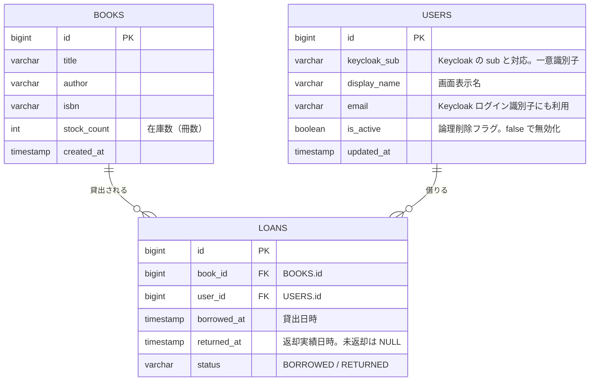

# ER 図

このドキュメントは、LibraShare の MVP-A における確定済み DB スキーマの ER 図です。認証・ロール管理の正は Keycloak とし、アプリ DB の `users` は貸出対象の利用者（`general_user`）のみを参照情報として保持します。社員・管理社員は `users` に登録せず Keycloak で管理します。

参照元は [README.md](README.md) の「DB スキーマ（MVP-A）」です。

## エンティティ関連図



## リレーション

| 関係 | カーディナリティ | 説明 |
|------|------------------|------|
| `BOOKS` — `LOANS` | 1 対 0..N | 1 冊の本は複数の貸出履歴を持つ |
| `USERS` — `LOANS` | 1 対 0..N | 1 利用者は複数の貸出履歴を持つ |

`loans` は `book_id` / `user_id` を外部キーに持ち、「誰がいつどの本を借りたか」を記録する履歴テーブルです。

## 制約（MVP-A の決定事項）

この節は、ER 図だけでは表現しづらい制約（参照アクション、CHECK、索引方針など）を明文化したものです。

### 外部キー（参照整合性）

- `loans.book_id` → `books.id`
- `loans.user_id` → `users.id`

参照アクションは **物理削除をしにくくし、履歴を壊さない** 方針とし、次を採用します。

- **ON DELETE**: `RESTRICT`（または `NO ACTION`）
- **ON UPDATE**: `RESTRICT`（または `NO ACTION`）

補足:

- `books` は **貸出履歴（`loans`）が 1 件でも存在する場合は削除不可** とします。
- `users` は物理削除ではなく **論理削除（`is_active=false`）** を正とします。

### CHECK（整合性）

- `books.stock_count >= 0`
- `loans.status IN ('BORROWED', 'RETURNED')`
- `loans.status='BORROWED'` のとき `returned_at IS NULL`
- `loans.status='RETURNED'` のとき `returned_at IS NOT NULL`
- `returned_at IS NULL OR returned_at >= borrowed_at`

### UNIQUE（推奨）

Keycloak 連携の前提（識別子の一意性）を保つため、次を推奨します。

- `users.keycloak_sub` は UNIQUE
- `users.email` は UNIQUE（Keycloak のログイン識別子にも利用する想定のため）

### 索引（決定）

追加索引は最小限とし、**`loans` の外部キー列のみ**作成します（`books` / `users` には追加索引を作らない）。

- `loans(book_id)`
- `loans(user_id)`

## テーブル作成 SQL（PostgreSQL）

`varchar` の最大長は現時点の暫定値です（必要に応じて調整してください）。

```sql
-- books
CREATE TABLE IF NOT EXISTS books (
  id BIGINT GENERATED ALWAYS AS IDENTITY PRIMARY KEY,
  title VARCHAR(255) NOT NULL,
  author VARCHAR(255) NOT NULL,
  isbn VARCHAR(32),
  stock_count INTEGER NOT NULL,
  created_at TIMESTAMPTZ NOT NULL DEFAULT now(),
  CONSTRAINT chk_books_stock_count_non_negative CHECK (stock_count >= 0)
);

-- users（貸出対象の利用者 general_user のみ）
CREATE TABLE IF NOT EXISTS users (
  id BIGINT GENERATED ALWAYS AS IDENTITY PRIMARY KEY,
  keycloak_sub VARCHAR(36) NOT NULL,
  display_name VARCHAR(100) NOT NULL,
  email VARCHAR(255) NOT NULL,
  is_active BOOLEAN NOT NULL DEFAULT TRUE,
  updated_at TIMESTAMPTZ NOT NULL DEFAULT now(),
  CONSTRAINT uq_users_keycloak_sub UNIQUE (keycloak_sub),
  CONSTRAINT uq_users_email UNIQUE (email)
);

-- loans
CREATE TABLE IF NOT EXISTS loans (
  id BIGINT GENERATED ALWAYS AS IDENTITY PRIMARY KEY,
  book_id BIGINT NOT NULL,
  user_id BIGINT NOT NULL,
  borrowed_at TIMESTAMPTZ NOT NULL,
  returned_at TIMESTAMPTZ,
  status VARCHAR(16) NOT NULL,
  CONSTRAINT fk_loans_book_id FOREIGN KEY (book_id)
    REFERENCES books (id)
    ON DELETE RESTRICT
    ON UPDATE RESTRICT,
  CONSTRAINT fk_loans_user_id FOREIGN KEY (user_id)
    REFERENCES users (id)
    ON DELETE RESTRICT
    ON UPDATE RESTRICT,
  CONSTRAINT chk_loans_status CHECK (status IN ('BORROWED', 'RETURNED')),
  CONSTRAINT chk_loans_returned_at_status CHECK (
    (status = 'BORROWED' AND returned_at IS NULL)
    OR
    (status = 'RETURNED' AND returned_at IS NOT NULL)
  ),
  CONSTRAINT chk_loans_returned_at_after_borrowed_at CHECK (
    returned_at IS NULL OR returned_at >= borrowed_at
  )
);

-- 索引（決定: loans の外部キー列のみ）
CREATE INDEX IF NOT EXISTS idx_loans_book_id ON loans (book_id);
CREATE INDEX IF NOT EXISTS idx_loans_user_id ON loans (user_id);
```

## 補足

- `users` は貸出対象の利用者（`general_user`）のみを保持する参照テーブルです。認証・パスワード・ロールの正は Keycloak です。社員・管理社員は `users` に含めず、Keycloak コンソールで管理します。
- 付与ロールは常に `general_user` のため `users` に `role` カラムは持ちません。ロール判定は JWT で行います。
- アプリ DB は独自の `username` を持たず、表示は `display_name`、一意識別は `keycloak_sub` で行います。Keycloak のログイン識別子には `email` を用いる想定です。
- 利用者削除は物理削除ではなく、`is_active=false` による論理削除 + Keycloak 無効化で行います。過去の `loans` 履歴は保持します。
- `loans.returned_at` は返却された実績日時で、`status` と対応します（貸出中は NULL）。返却予定日 `due_at` は MVP-A のスコープ外です。
- 型は PostgreSQL 前提です。`varchar` は長さ制約を意図した表記で、実装時に各カラムの最大長を定めます。
- 延滞管理（`due_at` / `overdue_at`、`OVERDUE` ステータス）などの拡張は [docs/future-considerations.md](docs/future-considerations.md) を参照してください。
