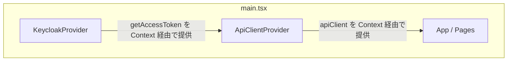
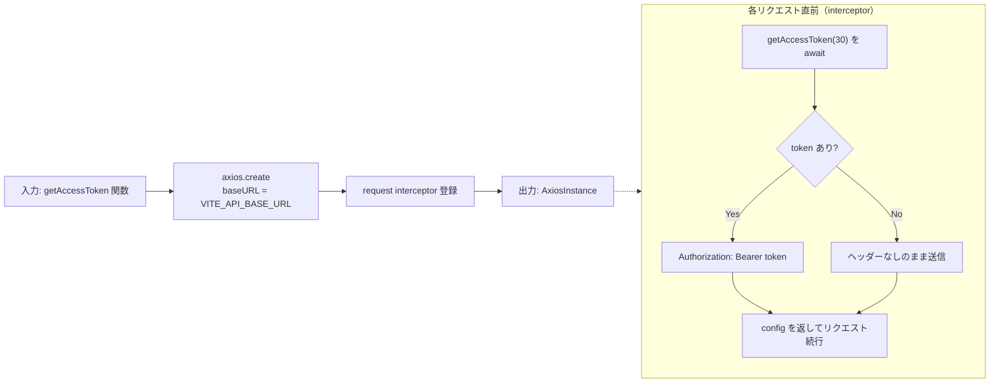
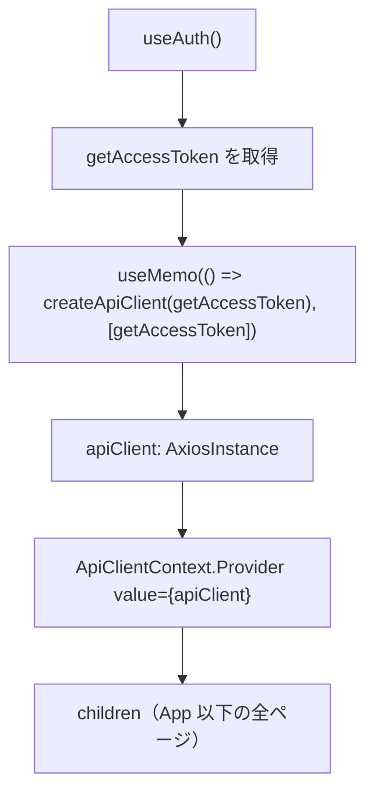
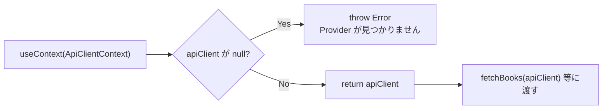
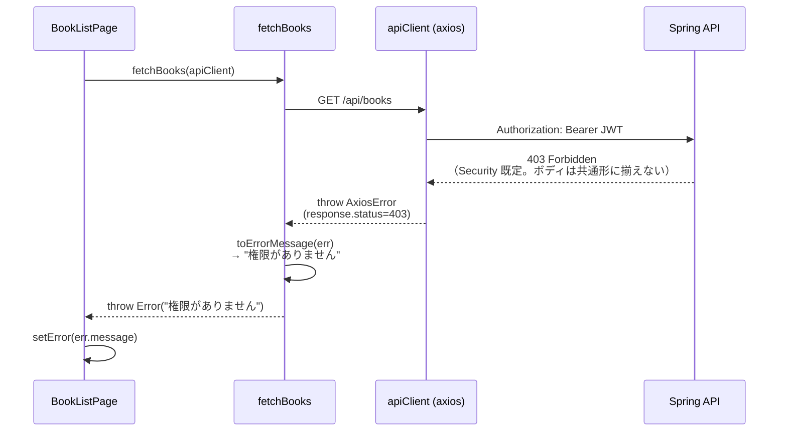
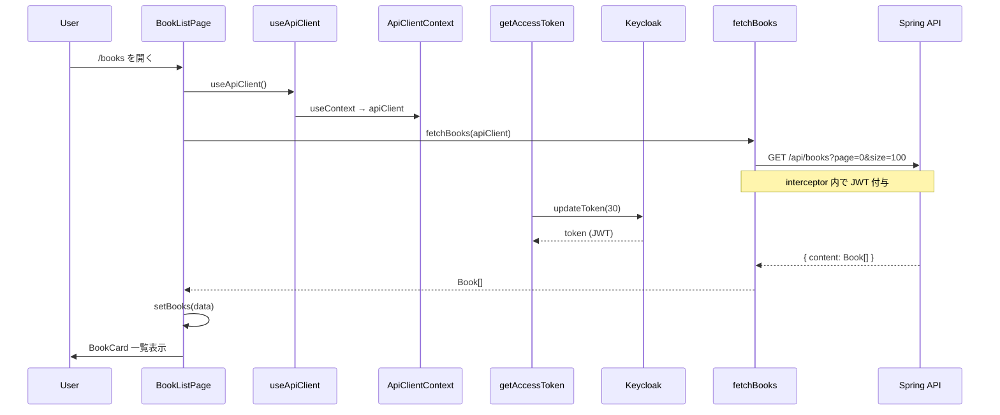

# React + API クライアント学習メモ（F-02）

Member B（フロント）向け。LibraShare の蔵書 API 接続（F-02）を進めるうえで、ここまで学習・実装した内容をまとめたものです。

設計の正は引き続き以下を参照してください。

- [openapi-notes.md](./openapi-notes.md) — API 契約（パス・レスポンス形式）
- [sequence-diagram.md](./sequence-diagram.md) — 蔵書 CRUD フロー
- [frontend-gap-analysis.md](./frontend-gap-analysis.md) — 残タスク一覧
- [frontend-keycloak-learning.md](./frontend-keycloak-learning.md) — F-01 認証（前提）

---

## 1. 全体像

F-01 で Keycloak 認証ができたあと、**JWT 付き axios** で Spring API を呼ぶ層を追加した。

```
[Page] ── useApiClient() ──> [apiClient (axios)]
                                  │
                    interceptor: Authorization: Bearer <JWT>
                                  │
                                  ▼
                         [Spring API /api/books ...]
```

### レイヤー分担

| レイヤー | ファイル | 責務 |
|----------|----------|------|
| 認証 | `auth/AuthContext.tsx` | Keycloak 初期化・`getAccessToken()` |
| HTTP クライアント | `api/client.ts` | axios 生成・JWT インターセプター |
| Context 配布 | `api/ApiClientContext.tsx` | `apiClient` を React ツリーに提供 |
| API 関数 | `api/books.ts` 等 | エンドポイント呼び出し・エラー変換 |
| ページ | `pages/BookListPage.tsx` 等 | `useApiClient` → API 関数 → state 更新 |

### Provider の入れ子（`main.tsx`）

`ApiClientProvider` は `KeycloakProvider` の**内側**に置く。`getAccessToken` が `useAuth()` 経由で必要なため。

```tsx
<KeycloakProvider>
  <ApiClientProvider>
    <App />
  </ApiClientProvider>
</KeycloakProvider>
```

---

## 2. 実装レビュー総評（F-02 蔵書 API）

| 項目 | 評価 |
|------|------|
| API パス `/api/books` | OK |
| Spring Page の `content` 展開 | OK |
| `Book.id: number` への型整合 | OK |
| 404 を `null` にする `fetchBookById` | OK（詳細ページの「見つかりません」表示と整合） |
| 各ページでの `useApiClient` 利用 | OK |
| `toErrorMessage` + `throw new Error` パターン | OK（ページ側は `err.message` だけで済む） |

### 軽微な改善メモ（任意）

| 項目 | 内容 |
|------|------|
| 未使用 import | `api/books.ts` の `mockBooks` は削除可 |
| タイポ | `BookPageRespomse` → `BookPageResponse` |
| `useEffect` 依存配列 | `BookDetailPage` / `BookEditPage` は `[id, apiClient]` が厳密 |
| 文言 | `BookEditPage` の「利用者が見つかりません」→「書籍が見つかりません」 |
| `toErrorMessage` の型 | `{ message?: string }` の方が API が message を返さない場合に安全 |

### 未実装（次タスク）

- `deleteBook`（F-02c 削除確認ダイアログ + `DELETE /api/books/{id}`）
- `api/users.ts` / `api/loans.ts` の API 接続（F-06 / F-04 / F-05）

---

## 3. `ApiClientContext.tsx` — 関数ごとのデータの流れ

### 3.1 全体の Provider ツリー



---

### 3.2 `createApiClient`（`api/client.ts`）

**役割**: JWT 付与ロジックを持った axios インスタンスを **1 回だけ** 作る工場。



**データの流れ（1 リクエストあたり）**

```
apiClient.get("/api/books")
  → interceptor 発火
  → getAccessToken(30)
      → Keycloak updateToken（残り30秒未満なら更新）
      → keycloakInstance.token（JWT 文字列）
  → Authorization ヘッダー付与
  → GET http://localhost:8081/api/books
```

`getAccessToken` は **axios とは独立した関数**として渡している。`books.ts` は Keycloak を知らなくてよい設計になる。

**実装（抜粋）**

```ts
// api/client.ts
export function createApiClient(
  getAccessToken: (minValiditySeconds?: number) => Promise<string | null>
) {
  const apiClient = axios.create({
    baseURL: import.meta.env.VITE_API_BASE_URL ?? "http://localhost:8080",
  })

  apiClient.interceptors.request.use(async (config) => {
    const token = await getAccessToken(30)
    if (!token) return config
    // Authorization: Bearer {token} を付与
    return config
  })
  return apiClient
}
```

---

### 3.3 `ApiClientProvider`（`api/ApiClientContext.tsx`）

**役割**: React ツリーに「JWT 付き axios」を 1 インスタンス配布する。



| 入力 | 処理 | 出力 |
|------|------|------|
| `children` | `useAuth` で `getAccessToken` 取得 | — |
| `getAccessToken` | `createApiClient` で axios 生成 | `apiClient` |
| `apiClient` | Context Provider に載せる | 子コンポーネントが `useApiClient` で取得可能 |

**`useMemo` の意味**

`getAccessToken` が変わらない限り axios インスタンスを作り直さない。作り直すと interceptor の再登録や、参照が変わって `useEffect([apiClient])` が余計に走る可能性がある。

**実装（抜粋）**

```tsx
// api/ApiClientContext.tsx
export function ApiClientProvider({ children }: { children: ReactNode }) {
  const { getAccessToken } = useAuth()
  const apiClient = useMemo(() => createApiClient(getAccessToken), [getAccessToken])
  return <ApiClientContext.Provider value={apiClient}>{children}</ApiClientContext.Provider>
}
```

---

### 3.4 `useApiClient`（`api/ApiClientContext.tsx`）

**役割**: ページ・コンポーネントから axios を取り出す custom hook。



**なぜ hook なのか**

`books.ts` は React の外（ただの async 関数）なので `useApiClient` を呼べない。だから **ページで hook → 引数で渡す** という形が正解。

```tsx
// ページ側のパターン
const apiClient = useApiClient()
useEffect(() => {
  fetchBooks(apiClient)
    .then((data) => setBooks(data))
    .catch((err) => setError(err.message))
    .finally(() => setLoading(false))
}, [apiClient])
```

---

## 4. `api/books.ts` — API 関数とデータの流れ

### 4.1 型の整合

API は `id` を **number** で返す。フロントの `Book` 型も `number` に揃えた。

```ts
// types/Book.ts
export type Book = {
  id: number
  title: string
  author: string
  isbn: string
  stockCount: number
}
```

URL の `:id`（`useParams`）は文字列だが、`/api/books/${id}` にそのまま埋め込めば Spring 側で解釈される。

### 4.2 一覧取得と Spring Page

`GET /api/books` は Spring Page 形式で返る。MVP-A ではページング UI（F-11）なしのため、`page=0&size=100` で `content` だけ使う。

```ts
type BookPageResponse = {
  content: Book[]
}

export async function fetchBooks(apiClient: AxiosInstance): Promise<Book[]> {
  const response = await apiClient.get<BookPageResponse>("/api/books", {
    params: { page: 0, size: 100 },
  })
  return response.data.content
}
```

### 4.3 各関数の入出力

| 関数 | 入力 | HTTP | 出力 |
|------|------|------|------|
| `fetchBooks` | `apiClient` | `GET /api/books` | `Book[]` |
| `fetchBookById` | `apiClient`, `id` | `GET /api/books/{id}` | `Book` または 404 時 `null` |
| `createBook` | `apiClient`, フォームデータ | `POST /api/books` | 作成された `Book` |
| `updateBook` | `apiClient`, `id`, フォームデータ | `PUT /api/books/{id}` | 更新後の `Book` |

---

## 5. `toErrorMessage` の解説（データの流れ中心）

### 5.1 何のためにあるか

axios は HTTP エラー時に **普通の `Error` ではなく** `AxiosError` を `throw` する。ページ側は `.catch((err) => setError(err.message))` という単純な形にしたいので、`books.ts` の `catch` で **人間が読める `string` に変換**してから `new Error(...)` で再スローする。

### 5.2 エラー時のデータの流れ



### 5.3 実装と分岐

```ts
function toErrorMessage(err: unknown): string {
  if (isAxiosError(err)) {
    // 401/403 は固定方針（API ボディを共通形に揃えない）
    if (err.response?.status === 403) return "権限がありません"
    const data = err.response?.data as { error?: string; message?: string } | undefined
    return data?.message ?? err.message
  }
  if (err instanceof Error) return err.message
  return "不明なエラーが発生しました"
}
```

| 入力 `err` | 判定 | 出力 string | 画面に出る例 |
|------------|------|-------------|--------------|
| axios の HTTP エラー + status 403 | `isAxiosError` → 403 分岐 | `"権限がありません"` | admin 以外が CRUD したとき |
| axios の HTTP エラー + その他 | `response.data.message` があればそれ、なければ `err.message` | API の `message`（`error` コードは MVP-A では未使用可） | 400 バリデーション / 409 業務衝突 |
| 通常の `Error`（ネットワーク切断など） | `instanceof Error` | `err.message` | `"Network Error"` 等 |
| 上記以外（稀） | 最後のフォールバック | `"不明なエラーが発生しました"` | 想定外の throw |

API のエラーボディ共通仕様（`{ error, message }` / 400・409 / 401・403 固定）は [openapi-notes.md](./openapi-notes.md) の「エラーレスポンス共通仕様」を正とする。

**`isAxiosError(err)` とは**

axios が提供する型ガード。`true` のときだけ `err.response.status` や `err.response.data` に安全にアクセスできる。`catch (err)` の `err` は `unknown` 型なので、この入口が必要。

**なぜ `throw new Error(toErrorMessage(err))` するか**

`fetchBooks` の呼び出し元は「成功 → `Book[]`」「失敗 → `Error` の `message` が日本語」という契約だけ知っていればよい、という **境界の整理**。axios の詳細は `books.ts` に閉じ込められる。

**`fetchBookById` だけ特別な理由**

404 は「エラー画面」ではなく「書籍が見つかりません」UI にしたいので、`toErrorMessage` に渡す前に `return null` で抜ける。

```
404 → null → BookDetailPage の if (!book) → 穏やかなメッセージ
403/500 → toErrorMessage → throw → setError → 赤いエラー表示
```

---

## 6. 成功時のエンドツーエンド（蔵書一覧の例）



### ページ側の 3 状態パターン

| 状態 | 条件 | 表示 |
|------|------|------|
| `loading` | 取得中 | 「読み込み中...」 |
| `error` | catch で `setError` | 赤いエラーメッセージ |
| `data` | 成功 | `BookCard` 一覧 |

---

## 7. 接続したページ一覧

| ページ | API 関数 | 備考 |
|--------|----------|------|
| `BookListPage` | `fetchBooks` | `useEffect([apiClient])` |
| `BookDetailPage` | `fetchBookById` | `fetchUsers` はまだ mock |
| `BookCreatePage` | `createBook` | 成功後 `navigate('/books')` |
| `BookEditPage` | `fetchBookById`, `updateBook` | admin のみ（`ProtectedRoute requireAdmin`） |

### 環境変数

```env
# .env.development
VITE_API_BASE_URL=http://localhost:8081
VITE_KEYCLOAK_URL=http://localhost:8080
VITE_KEYCLOAK_REALM=LibraShare
VITE_KEYCLOAK_CLIENT_ID=front-client
```

---

## 8. よくあるエラー

| 症状 | 原因 |
|------|------|
| CORS エラー | API 側 CORS 設定 / ポート不一致 |
| 401 | JWT 未送信 → `ApiClientProvider` の位置・ログイン状態を確認 |
| 403 | ロール不足（蔵書 CRUD は `admin_employee` のみ） |
| 空配列 | DB にデータなし、または `content` の取り方ミス |
| Provider エラー | `useApiClient` を `ApiClientProvider` の外で呼んでいる |

---

## 9. まとめ

- **`toErrorMessage`**: axios の生エラーを UI 向け `string` に変換する **API 層の出口**。403 は固定文言、404 は `fetchBookById` だけ別ルート（`null`）。
- **`ApiClientContext`**: `getAccessToken`（認証）と `apiClient`（HTTP）を **React Context で橋渡し**し、各ページは `useApiClient()` → `fetchXxx(apiClient)` という一定のパターンで呼ぶ。
- **F-02 の核**（一覧・詳細・追加・更新の API 接続）は完了。次は F-02c（削除）または F-06（利用者 API）へ進める。

---

## 関連ドキュメント

- [frontend-keycloak-learning.md](./frontend-keycloak-learning.md) — F-01 認証
- [openapi-notes.md](./openapi-notes.md) — API 契約
- [frontend-gap-analysis.md](./frontend-gap-analysis.md) — 残タスク
