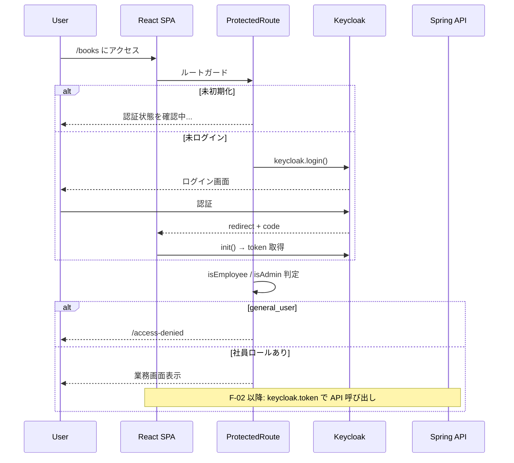

# React + Keycloak 学習メモ（F-01）

Member B（フロント）向け。LibraShare の Keycloak ログイン連携（F-01）を進めるうえで、ここまで学習・実装した内容をまとめたものです。

設計の正は引き続き以下を参照してください。

- [screen-transition.md](./screen-transition.md) — 認証と認可の分離
- [sequence-diagram.md](./sequence-diagram.md) — OIDC フロー
- [frontend-gap-analysis.md](./frontend-gap-analysis.md) — 残タスク一覧

---

## 1. 全体像

LibraShare のフロントは **keycloak-js**（Keycloak JavaScript Adapter）で OIDC 認証を行い、取得した `access_token` を API 呼び出しに付与します。

```
[React SPA] ── OIDC (Authorization Code + PKCE) ──> [Keycloak]
      │
      └── Authorization: Bearer <JWT> ──> [Spring API]
```

### 認証と認可の分離

| 状態 | 挙動 |
|------|------|
| 未ログイン | `ProtectedRoute` から Keycloak ログイン画面（外部）へ誘導（`keycloak.login()`） |
| ログイン済み + 社員ロールあり | SPA 利用可（`general_employee` / `admin_employee`） |
| ログイン済み + `general_user` のみ | 認証は通るが SPA 利用不可 → `/access-denied` |

ロールは JWT の `realm_access.roles` から `auth/roles.ts` で判定します。

---

## 2. 前提・環境

### Node.js は必要か

| 領域 | Node.js |
|------|---------|
| Keycloak サーバー | 不要（Docker 上の Java アプリ） |
| Spring Boot API | 不要（Java 21） |
| React フロント（Vite） | **必要**（`npm install` / `npm run dev` / `keycloak-js` 導入） |

Docker の frontend コンテナ（`node:20-alpine`）だけ使う場合は、ホストへの Node.js インストールは省略可能です。ただし手元での開発では **Node.js 20+** を入れておくのが一般的です。

### 環境変数（`.env.development`）

```env
VITE_KEYCLOAK_URL=http://localhost:8080
VITE_KEYCLOAK_REALM=LibraShare
VITE_KEYCLOAK_CLIENT_ID=front-client
```

`docker-compose.yml` のバックエンドは `KEYCLOAK_ISSUER_URI: http://keycloak:8080/realms/LibraShare` を参照しています。Realm 名・クライアント ID は import（`docker/keycloak/import/LibraShare-realm.json`）と揃えます。

### テストユーザー（Keycloak import）

| ユーザー名 | ロール | SPA 利用 |
|------------|--------|----------|
| `admin_test@example.com` | `admin_employee` | 可 |
| `employee_test@example.com` | `general_employee` | 可 |
| `user_test@example.com` | `general_user` | 不可（`/access-denied`） |

パスワードは realm JSON にはハッシュのみ。Keycloak 管理コンソール（`admin` / `admin`）で確認・再設定します。

### Keycloak クライアント設定（Member A と要確認）

`onLoad: 'check-sso'` を使う場合、Keycloak 管理コンソールで最低限以下が必要です。

| 設定 | 例 |
|------|-----|
| Client type | Public（SPA） |
| Valid redirect URIs | `http://localhost:5173/*` |
| Web origins | `http://localhost:5173` |
| Realm roles | `general_user`, `general_employee`, `admin_employee` |

`docs/` の Keycloak 設定の正は `docker/keycloak/import/LibraShare-realm.json` です。

---

## 3. パッケージ

```bash
npm install keycloak-js
```

`package.json` の dependencies に `keycloak-js` が追加されます。

---

## 4. 実装の骨格（ここまで完了）

実装ファイル: `frontend/src/auth/AuthContext.tsx`

### 4.1 Keycloak インスタンスの保持（シングルトン）

`Keycloak` インスタンスは **コンポーネント外（モジュールスコープ）** で1回だけ生成します。

```typescript
const keycloakInstance = new Keycloak({
  url: import.meta.env.VITE_KEYCLOAK_URL,
  realm: import.meta.env.VITE_KEYCLOAK_REALM,
  clientId: import.meta.env.VITE_KEYCLOAK_CLIENT_ID,
})
```

**なぜコンポーネント外か**

- 再レンダーのたびに `new Keycloak()` されるのを防ぐ
- アプリ全体で同じインスタンスを共有する
- `init()` は同一インスタンスに対して1回にまとめる必要がある

### 4.2 初期化オプション

```typescript
keycloakInstance.init({
  onLoad: 'check-sso',
  pkceMethod: 'S256',
})
```

| オプション | 意味 |
|------------|------|
| `onLoad: 'check-sso'` | ページ読み込み時に既存セッションをサイレント確認。未ログインならそのまま表示 |
| `pkceMethod: 'S256'` | SPA 向け PKCE（Proof Key for Code Exchange） |

`onLoad: 'login-required'` にすると、未ログイン時に即 Keycloak ログイン画面へリダイレクトします。LibraShare ではまず `check-sso` でセッション復元を試みる方針です。

### 4.3 Context / Provider / Hook

```typescript
interface KeycloakContextType {
  keycloak: Keycloak | null
  isAuthenticated: boolean
  isInitialized: boolean
}

export const KeycloakProvider = ({ children }) => { ... }
export const useAuth = () => useContext(KeycloakContext)
```

| 値 | 意味 |
|----|------|
| `keycloak` | Keycloak インスタンス（login / logout / token 取得に使う） |
| `isAuthenticated` | ログイン済みか（`init()` 成功後の `boolean`） |
| `isInitialized` | Keycloak 初期化処理が完了したか（成功・失敗どちらでも `true` にする） |

**`isAuthenticated` と `isInitialized` の違い**

- `isInitialized === false` → まだ init の結果がわからない（ローディング表示に使う）
- `isInitialized === true` かつ `isAuthenticated === false` → init は終わったが未ログイン
- `isInitialized === true` かつ `isAuthenticated === true` → ログイン済み

---

## 5. init の二重実行防止（`initPromise` パターン）

### 問題: React StrictMode

`main.tsx` で `<StrictMode>` を使っていると、**開発時のみ** `useEffect` が2回実行されることがあります。

```
1回目: マウント → useEffect → init()
2回目: アンマウント → 再マウント → useEffect → init() 再度 ⚠️
```

`keycloak-js` の `init()` は同一インスタンスに複数回呼ぶと不安定になりうるため、**init 自体を1回に束ねる**必要があります。

### 解決: モジュールレベルで Promise を保持

```typescript
let initPromise: Promise<boolean> | null

function initKeycloak(): Promise<boolean> {
  if (!initPromise) {
    initPromise = keycloakInstance.init({
      onLoad: 'check-sso',
      pkceMethod: 'S256',
    })
  }
  return initPromise
}
```

| 質問 | 答え |
|------|------|
| 実行済みフラグ？ | 近い。ただし `boolean` ではなく **init の Promise を保持**している |
| なぜ `let`？ | 最初は `null`、後から `Promise` を1回代入するため |
| `init()` の戻り値は `boolean`？ | **いいえ、`Promise<boolean>`**。`.then` の引数が `boolean` |

```
initPromise = null           → まだ init していない
initPromise = Promise<...>   → すでに init 開始済み（進行中 or 完了）
```

2回目以降の `initKeycloak()` は新しい `init()` を呼ばず、**保存済みの Promise を返す**だけです。

---

## 6. `useEffect` 内の Promise の動き

```typescript
useEffect(() => {
  initKeycloak()
    .then((authenticated) => {
      setIsAuthenticated(authenticated)
      setIsInitialized(true)
    })
    .catch((err) => {
      console.error('Keycloak init failed', err)
      setIsInitialized(true)
    })
}, [])
```

### 時間の流れ

```
t0: useEffect 開始
t1: initKeycloak() 呼び出し → Promise<boolean> が返る（まだ pending の可能性）
t2: .then / .catch を登録
t3: useEffect 終了（ここで init 完了は待たない）
...
t4: Keycloak init 完了
t5: 成功 → .then に boolean が渡る / 失敗 → .catch に error が渡る
t6: setState → React 再レンダー
```

### `.then` と `.catch` の役割

| 経路 | 条件 | 処理 |
|------|------|------|
| `.then` | init **成功** | `authenticated` は `true`（ログイン済み）または `false`（未ログイン） |
| `.catch` | init **失敗** | Keycloak 未起動・Realm 未作成・Client 設定ミスなど |

**注意:** `authenticated === false` はエラーではない。init は成功したがセッションがなかった、という意味です。

**`.catch` でも `setIsInitialized(true)` にする理由:** init が失敗しても「初期化処理は終わった」とマークし、画面が永遠にローディングのままになるのを防ぐためです。

### `async/await` との対応

```typescript
useEffect(() => {
  ;(async () => {
    try {
      const authenticated = await initKeycloak()
      setIsAuthenticated(authenticated)
      setIsInitialized(true)
    } catch (err) {
      console.error('Keycloak init failed', err)
      setIsInitialized(true)
    }
  })()
}, [])
```

動きは `.then` / `.catch` 版と同じです。

---

## 7. 実装状況（F-01）

| 項目 | 状態 | メモ |
|------|------|------|
| `initPromise` による二重 init 防止 | 済 | §5 |
| `.catch` でのエラーハンドリング | 済 | §6 |
| `main.tsx` への `KeycloakProvider` 接続 | 済 | |
| 初期化中のローディング UI | 済 | `ProtectedRoute` / `AccessDeniedPage` |
| `logout()`（Layout / AccessDeniedPage） | 済 | `keycloak.logout()` |
| ロール判定（`auth/roles.ts`） | 済 | JWT `realm_access.roles` |
| `ProtectedRoute` | 済 | 未ログイン → `keycloak.login()` |
| `AccessDeniedPage` | 済 | `general_user` 拒否 UX |
| Layout / BookDetail の admin 出し分け | 済 | `isAdmin` |
| `api/client.ts` の Bearer 注入 | 未 | F-02 前に対応 |
| トークン更新（`updateToken`） | 未 | 余力 |

---

## 8. 次の実装ステップ（参考）

1. `api/client.ts` で `keycloak.token` を注入
2. 蔵書 API 接続（F-02）
3. 利用者管理 API（F-06）
4. 貸出/返却 API（F-04）→ 貸出中一覧（F-05）

---

## 9. 関連ファイル

| ファイル | 役割 |
|----------|------|
| `frontend/src/auth/AuthContext.tsx` | Keycloak 保持・初期化・Context |
| `frontend/src/auth/roles.ts` | ロール判定 |
| `frontend/src/components/ProtectedRoute.tsx` | 認証・認可ガード |
| `frontend/src/pages/AccessDeniedPage.tsx` | `general_user` 拒否画面 |
| `frontend/.env.development` | `VITE_KEYCLOAK_*` |
| `frontend/src/main.tsx` | `KeycloakProvider` 接続 |
| `frontend/src/api/client.ts` | Bearer 注入（未: Keycloak 化） |
| `docker/keycloak/import/LibraShare-realm.json` | Realm・クライアント・テストユーザー |
| `docker-compose.yml` | Keycloak / backend の issuer URI |

---

## 10. 用語クイックリファレンス

| 用語 | 説明 |
|------|------|
| OIDC | OpenID Connect。Keycloak が提供する認証プロトコル |
| PKCE | 公開クライアント（SPA）向けの認可コード傍受対策 |
| `check-sso` | サイレントに既存セッションを確認する init モード |
| `access_token` | API 呼び出しに使う JWT |
| `realm_access.roles` | JWT 内のロール一覧（社員判定に使用） |
| `initPromise` | init の二重実行を防ぐための共有 Promise |

---

## 11. 実装セッション Q&A まとめ（2026-07-09）

F-01 実装中に発生した質問と回答を、設計判断・実装・トラブルシュートの順に整理したものです。

---

### 11.1 設計: `/login` SPA ルートは要るか

**Q:** Keycloak の既存ログイン画面を使うなら `LoginPage.tsx` は不要では？`ProtectedRoute` で未ログイン時に `keycloak.login()` を呼べばよいのでは？

**A:** その方針で問題ない。SPA に `/login` ルートを設けず、未ログイン検知時に `keycloak.login()` で Keycloak 外部画面へ遷移するのは一般的なパターン。

**Q:** README 設計では `/login` はなかったのでは？

**A:** ドキュメント間で不整合があった。

- `docs/screen-transition.md` は当初 `/login` を SPA ルートとして記載
- `README.md` は「ログイン画面」の存在は示すが `/login` パスは明示していなかった

**採用した整理:**

- 画面遷移図の「ログイン」は **Keycloak ログイン画面（外部）** と定義
- SPA ルート一覧から `/login` を除外
- 未ログイン時は `ProtectedRoute` が `keycloak.login()` を呼ぶ

→ `docs/screen-transition.md` をこの方針で更新済み。

---

### 11.2 実装の流れ（F-01）

**現状確認時点でできていたこと:**

- `KeycloakProvider`（`main.tsx`）
- `AuthContext`（`check-sso` + PKCE）
- 各ページ骨格・mock API

**F-01 で実装したこと:**

| ファイル | 役割 |
|----------|------|
| `auth/roles.ts` | JWT ロール判定（`isEmployee` / `isAdmin`） |
| `components/ProtectedRoute.tsx` | 認証・認可ガード |
| `pages/AccessDeniedPage.tsx` | `general_user` 拒否 |
| `App.tsx` | ルート保護・`requireAdmin` |
| `Layout.tsx` | ロール別ナビ・ログアウト |
| `BookDetail.tsx` | 編集リンクの admin 出し分け |

**F-01 完了判定（SPA 認証・認可）:** 完了可。`api/client.ts` の JWT 注入は F-02 前のフォローアップ。

---

### 11.3 Context と `useAuth()`

**Q:** `useAuth()` で取り出せるのは、App が Context で包まれているから？

**A:** 正しい。

```
main.tsx: KeycloakProvider → App → ProtectedRoute / Layout / Page
                                      └ useAuth() で同じ value を参照
```

`KeycloakProvider` がマウントされたときに `init()` が走り、子孫コンポーネントは `useAuth()` で `keycloak` / `isAuthenticated` / `isInitialized` を読める。

---

### 11.4 トークンの保持場所とタイミング

**Q:** Context の中にトークンなどの情報も保持している？

**A:** 半分正しい。Context が直接持つのは次の3つだけ。

- `keycloak`（インスタンスへの参照）
- `isAuthenticated`
- `isInitialized`

**トークン文字列は Context の state には入らない。** `keycloak-js` が `keycloakInstance` 内部に保持する。

| 取り出し方 | 内容 |
|------------|------|
| `keycloak.token` | access_token（API の Bearer に使う） |
| `keycloak.tokenParsed` | デコード済み JWT（`realm_access.roles` 等） |
| `keycloak.refreshToken` | 更新用トークン |

**ログイン成功後の流れ:**

```
keycloak.login() → Keycloak 外部画面で認証 → redirectUri へ戻る
  → アプリ再読み込み → keycloak.init() が code を token に交換
  → keycloak.token / tokenParsed がインスタンスにセット
  → init が true → isAuthenticated=true
```

アプリ側が「トークンを Context に set する」処理はない。`keycloak-js` が担う。

---

### 11.5 Keycloak 初期化はいつ走るか

**Q:** `<KeycloakProvider>` で包んでいる App 内では常に初期化が走る？

**A:** 「App 内だから常に」ではなく **Provider マウント時に1回**（login 後のページ再読み込み時も1回）。

| タイミング | init 実行 |
|------------|-----------|
| 初回ページ読み込み | はい |
| SPA 内ルート遷移（`/books` → `/users`） | いいえ |
| `keycloak.login()` 後のリダイレクト戻り | はい |

`initPromise` により、同一ページ内での `keycloak.init()` 二重呼び出しは防いでいる。

---

### 11.6 `ProtectedRoute` の動き

**Q:** `useEffect` が Context の値が変わるたびに発火し、認証がなければ login、確認中はフラグに応じて表示を変え、問題なければ子ルートを描画する流れで合っているか？

**A:** 概ね正しい。ただし **useEffect の `return` と render の `return` は別物**。

| 担当 | 処理 |
|------|------|
| `useEffect` | 副作用。未ログインなら `keycloak.login()` を呼ぶ（レンダー中に呼ばない） |
| render の `if` + `return` | 画面表示（ローディング / 拒否 / `<Outlet />`） |

**判定の流れ:**

```
1. !isInitialized → 「認証状態を確認中...」
2. !isAuthenticated → useEffect が login()、「ログイン画面へ移動中...」
3. !isEmployee → /access-denied
4. requireAdmin && !isAdmin → /access-denied
5. それ以外 → <Outlet />
```

**実装時にハマった点:**

- `useEffect` 内: `if (!isAuthenticated) return` は **逆**。正しくは `if (isAuthenticated) return` のあと `login()`
- render 内: `if (!isAuthenticated)` で「ログイン画面へ移動中...」（`if (isAuthenticated)` だと逆）
- 最後に `return <Outlet />` が必要

---

### 11.7 `requireAdmin` プロップ

**Q:** `requireAdmin` は管理者限定ルートかどうかのフラグで、`true` かつ管理者ロールがなければ閲覧不可ページへ飛ばす認識で合っているか？

**A:** 正しい。

| requireAdmin | ロール | 結果 |
|:------------:|--------|------|
| `false` | `general_employee` | 通過 |
| `false` | `admin_employee` | 通過 |
| `true` | `general_employee` | `/access-denied` |
| `true` | `admin_employee` | 通過 |
| どちらでも | `general_user` のみ | `/access-denied`（社員チェックで先に弾かれる） |

**TypeScript の注意:** `requireAdmin: boolean`（必須）のまま `<ProtectedRoute />` と書くと型エラー。`requireAdmin?: boolean` にする。

---

### 11.8 ログアウトと `redirectUri`

**実装:** `Layout` / `AccessDeniedPage` で `keycloak.logout({ redirectUri: window.location.origin })`

**Q:** `redirectUri: window.location.origin` はもともと window が見ていた場所へリダイレクト？

**A:** 厳密には **サイトの起点（オリジン）** に戻る。パスは含まない。

| 現在の URL | `origin` |
|------------|----------|
| `http://localhost:5173/books/1` | `http://localhost:5173` |

ログアウト後は未ログイン状態になり、`ProtectedRoute` が再度 Keycloak ログインへ誘導する。

**ログアウトボタンの CSS:** `<button class="nav-link">` はブラウザデフォルトスタイルが残るため、`button.nav-link` でリセットが必要（`theme/app.css` に追記済み）。

---

### 11.9 Docker / Keycloak 起動トラブル

**症状:** Keycloak 起動時に `Role "keycloak" does not exist` → DB 接続失敗。

**原因:** `docker/keycloak/init/01-create-keycloak-db.sh` は Postgres **初回初期化時のみ**実行される。既存の `postgres_data` ボリュームがあるとスクリプトが走らず、`keycloak` ロールが作られない。

**解決策:**

```bash
docker compose down -v   # 開発環境で DB 初期化してよい場合
docker compose up --build
```

または Postgres に手動で `keycloak` ユーザー・DB を作成。

**env の不一致（別件）:** 当初 `.env.development` が `library-realm` / `librashare-frontend` だったが、import の正は `LibraShare` / `front-client`。

---

### 11.10 テストユーザーの確認場所

| 確認先 | 内容 |
|--------|------|
| `docker/keycloak/import/LibraShare-realm.json` | ユーザー名・ロール（パスワードはハッシュのみ） |
| Keycloak 管理コンソール（`admin` / `admin`） | パスワードの確認・再設定 |
| Realm: `LibraShare` | |

---

### 11.11 F-01 完了レビュー（チェックリスト）

**手動テスト:**

- [ ] 未ログインで `/books` → Keycloak ログイン画面
- [ ] `employee_test@example.com` → 業務画面 OK、`/books/new` は拒否
- [ ] `admin_test@example.com` → 蔵書追加・編集 OK
- [ ] `user_test@example.com` → `/access-denied` + ログアウト可能
- [ ] ヘッダーからログアウト → 未ログイン状態に戻る

**軽微な改善候補（コード）:**

- `Layout.tsx` の未使用 `import keycloak from 'keycloak-js'` 削除
- `roles.ts` の optional chaining: `keycloak?.tokenParsed?.realm_access?.roles`

**フォローアップ（F-02 前）:**

- `api/client.ts` の `localStorage` → `keycloak.token`

---

### 11.12 Agent 向け「実装」依頼の進め方（ルール）

`AGENTS.md` / `.cursor/rules/libra-share-project.mdc` に追記済み。

1. **現状のコードを確認**（docs + 実装）
2. **次タスクを提示**
3. **写経コード + 解説**（機能・依存ライブラリ・データの流れを中心に。宣言の書き方の説明は不要）

---

### 11.13 データの流れ（F-01 全体）



