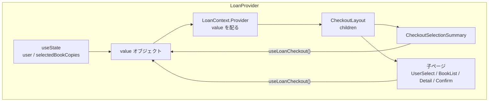
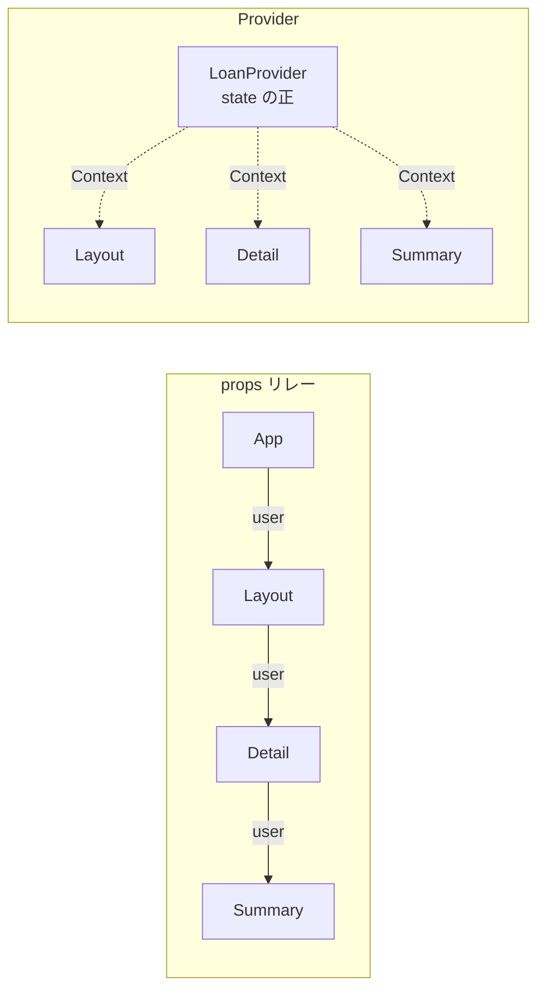
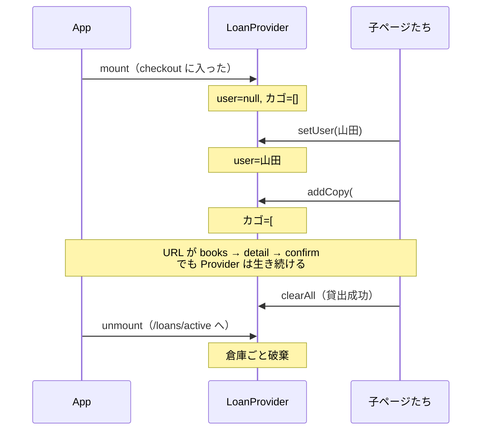

# F-04 / F-05 学習メモ（質問ベース・言語化）

フロントの checkout 一括貸出（F-04）と貸出中一覧・返却（F-05）について、実装中に出た疑問を中心に、**関数・引数・変数を日本語で言い換え**、あわせて **データの流れ（受け取り → 変換 → 渡し先）** を書いたメモ。

設計の正: [refactor-holdings-and-checkout.md](../design/refactor-holdings-and-checkout.md) / [openapi-notes.md](../api/openapi-notes.md)

---

## 1. 全体の流れ（何が起きるか）

```text
【F-04】
ナビ「貸出」
  → 利用者を選ぶ（GET /api/users）※バックエンド未実装だとここで止まる
  → 書誌カード一覧（GET /api/books）
  → 所蔵にチェック（GET /api/books/{id} の holdings）
  → 右サマリに蓄積（LoanProvider）
  → 確認 → POST /api/loans { userId, bookCopyIds }
  → 成功後クリア → /loans/active

【F-05】
ナビ「貸出中」
  → GET /api/loans/active
  → 返却 → PUT /api/loans/{loanId}/return
  → 一覧を再取得
```

**書誌（books）** = 作品の種類。  
**所蔵（book_copies / holdings）** = 物理的な 1 冊。貸出の正は所蔵 ID（`bookCopyId`）。

### 画面をまたぐデータの正（F-04）

```text
CheckoutUserSelectPage
  User（API）──setUser──► LoanProvider.user（CheckoutUser）
CheckoutBookDetailPage
  BookHolding + Book ──addCopy──► LoanProvider.selectedBookCopies
CheckoutConfirmPage
  user + selectedBookCopies ──map──► CreateLoanRequest ──POST──► サーバ
  成功 ──clearAll──► Provider 空 ──navigate──► /loans/active
```

---

## Provider / Context / children の仕組み（必読）

checkout では「利用者」と「選んだ所蔵」を **複数画面で共有**する必要がある。  
props で親→子→孫とリレーすると破綻しやすいので、**Provider（提供箱）+ Context（共有回線）** を使う。

### たとえ話

| 概念 | たとえ |
|------|--------|
| `LoanProvider` | 貸出カウンターの「共有引き出し」を置く部屋 |
| `useState`（中の state） | 引き出しの中身（利用者メモ・選んだ冊のリスト） |
| `value` | 引き出しの中身をまとめた書類 |
| `LoanContext.Provider` | 「この部屋の中なら書類を読める」と宣言する壁 |
| `children` | **その部屋の中に置く家具・人**（中身の画面） |
| `useLoanCheckout()` | 部屋の中にいる人が引き出しを開ける行為 |

**重要な点:** Provider は「データの倉庫」であり、画面そのものではない。倉庫の**中に**画面（`children`）を入れる。

### `children` とは何か

React では、タグの**挟まれた中身**が自動的に `children` という props になる。

```tsx
// App.tsx での書き方
<LoanProvider>
  <CheckoutLayout />   {/* ← これが children */}
</LoanProvider>
```

これは次と同じ意味になる。

```tsx
<LoanProvider children={<CheckoutLayout />} />
```

| 名前 | 日本語での意味 |
|------|----------------|
| `children` | 「このコンポーネントの内側に書かれた JSX」全部 |
| 型 `ReactNode` | 画面に置けるもの全般（要素・文字列・配列など） |

`LoanProvider` の実装はだいたいこうなっている。

```tsx
export function LoanProvider({ children }: { children: ReactNode }) {
  // ① 倉庫の中身（state）を持つ
  const [user, setUser] = useState(...)
  const [selectedBookCopies, setSelectedBookCopies] = useState(...)

  // ② 外に見せる書類（value）を作る
  const value = useMemo(() => ({ user, setUser, selectedBookCopies, addCopy, ... }), [...])

  // ③ 「この壁の内側では value が読める」＋ 内側に children を描画
  return (
    <LoanContext.Provider value={value}>
      {children}
    </LoanContext.Provider>
  )
}
```

**データの流れ（children まわり）**

```text
App が渡す
  children = <CheckoutLayout /> （およびその下の Outlet 配下ページ）

LoanProvider が受け取る
  引数 children

LoanProvider がすること
  state / value を用意する（children はまだ触らない）
  → <Provider value={value}> の内側に {children} をそのまま置く
  → children を書き換えたり変換したりはしない（「中に入れる」だけ）

CheckoutLayout やその子孫がすること
  useLoanCheckout() で value を読む / setUser や addCopy を呼ぶ
```

`children` 自体に利用者 ID が入っているわけではない。  
**同じ木（ツリー）の内側にいるから**、Context 経由で同じ倉庫に届く。

### 図1 — コンポーネントの入れ子（箱のイメージ）

```text
┌─────────────────────────────────────────────────────────┐
│ LoanProvider（倉庫を持つ・壁を立てる）                    │
│   state: user, selectedBookCopies                       │
│   value: { user, setUser, addCopy, ... }                │
│                                                         │
│   ┌─── LoanContext.Provider value={value} ───────────┐ │
│   │                                                   │ │
│   │   children ↓                                      │ │
│   │   ┌─────────────────────────────────────────────┐ │ │
│   │   │ CheckoutLayout                              │ │ │
│   │   │   ・ヘッダで user を表示（useLoanCheckout） │ │ │
│   │   │   ・右に CheckoutSelectionSummary           │ │ │
│   │   │   ・中央は <Outlet /> ← 今の子ページ        │ │ │
│   │   │       ┌───────────────────────────────┐     │ │ │
│   │   │       │ CheckoutBookDetailPage など   │     │ │ │
│   │   │       │ addCopy / removeCopy を呼ぶ   │     │ │ │
│   │   │       └───────────────────────────────┘     │ │ │
│   │   └─────────────────────────────────────────────┘ │ │
│   │                                                   │ │
│   └───────────────────────────────────────────────────┘ │
└─────────────────────────────────────────────────────────┘

外（例: /books の BookListPage）
  → LoanProvider の外なので useLoanCheckout() するとエラー
```

### 図2 — Context の「電波」イメージ



`useLoanCheckout()` は props を親から受け取っていない。  
**内側から Context を見上げて**、一番近くの `Provider` の `value` を取る。

### 図3 — なぜ props リレーをしないか

```text
【props リレー（やらない）】
App
  → Layout に user を渡す
    → CheckoutLayout に渡す
      → Detail に渡す
        → Summary にも渡す
→ 画面が増えるたびバケツリレー地獄

【Provider（採用）】
App
  → LoanProvider で state を1か所持つ
  → どの子孫も useLoanCheckout() で同じ state に届く
```



### 図4 — 画面遷移しても state が残る理由

React Router で URL が変わっても、**親の `LoanProvider` がアンマウントされなければ** state は残る。

```text
App.tsx:

<Route path="/loans/checkout" element={
  <LoanProvider>          ← ここが「チェックアウト中ずっと生きている箱」
    <CheckoutLayout />
  </LoanProvider>
}>
  <Route index element={<CheckoutUserSelectPage />} />
  <Route path="books" ... />
  <Route path="books/:id" ... />
  <Route path="confirm" ... />
</Route>
```

```text
時間の流れ:

1. /loans/checkout
   Provider 作成（user=null, カゴ=[]）
   children = Layout + UserSelect
   → setUser(山田) 

2. /loans/checkout/books
   Provider は同じインスタンスのまま（作り直されない）
   user はまだ山田
   Outlet の中身だけ BookList に差し替わる

3. /loans/checkout/books/1
   同じく Provider 維持
   addCopy → カゴに #12

4. /loans/checkout/confirm
   同じく Provider 維持
   createLoan 成功 → clearAll → navigate /loans/active

5. /loans/active
   checkout の Route を出た → LoanProvider が破棄
   → 倉庫の中身も消える（次の貸出は最初から）
```



### `useLoanCheckout` がエラーになるとき

```text
useLoanCheckout()
  → useContext(LoanContext) する
  → 近くに LoanContext.Provider が無い
  → null が返る
  → throw「LoanProvider 内で使ってください」
```

つまり **「倉庫の外で引き出しを開けようとした」** 状態。  
`/books` や `/loans/active` では `LoanProvider` で包んでいないので、そこで `useLoanCheckout` を呼んではいけない。

### 既存の似たパターン（このプロジェクト内）

同じ「Provider + children + Context」はすでに使っている。

| Provider | 共有しているもの |
|----------|------------------|
| `KeycloakProvider` / `AuthContext` | ログイン状態・トークン |
| `ApiClientProvider` | axios インスタンス |
| `LoanProvider` | checkout の利用者とカゴ |

`ApiClientProvider` も `{ children }` を受け取り、内側で `useApiClient()` できるようにしている。Loan 版も同じ形。

### 超短縮まとめ

1. **`children`** = Provider タグの内側に書いた画面。倉庫の「中に置く物」。  
2. **Provider** = state を持ち、Context で配り、`{children}` を描画する箱。  
3. **子は props で user を貰わない。** `useLoanCheckout()` で倉庫を読む。  
4. **checkout ルートのあいだ Provider が生きているから**、画面を移動してもカゴが残る。  
5. **checkout を出ると Provider が消える**ので、次の貸出はリセットされる。

---

## 2. よくあった質問と答え

### Q. `setUser: (user: CheckoutUser | null) => void` の意味は？

「利用者をセットする関数」の**型**。

| 言い換え | 意味 |
|----------|------|
| `setUser` | 貸出先利用者を書き換える関数の名前 |
| `(user: …)` | 引数を 1 つ取る |
| `CheckoutUser \| null` | 「利用者オブジェクト」か「いない（クリア）」 |
| `=> void` | 戻り値はない（画面用の状態を変えるだけ） |

**データの流れ（例）**

```text
引数 user = { id: 10, displayName: "山田太郎" }
  → setUser が LoanProvider 内の useState を更新
  → Context の value.user が変わる
  → CheckoutLayout の「利用者: 山田太郎」などが再描画
```

`setUser(null)` の場合は「貸出先なし」に戻る（`clearAll` でも同様）。

### Q. `useState` の `setUser` と違うの？

**実体は同じ。** `LoanProvider` 内の `useState` が返す setter を、Context 経由で子画面に公開しているだけ。

```text
LoanProvider 内:  const [user, setUser] = useState(...)
                       │
                       ▼ value に載せる
子画面:            useLoanCheckout().setUser(...)
```

### Q. `onToggle` は何をする？

チェックボックスの ON/OFF を、Context の「追加 / 削除」に翻訳する。

**データの流れ（例）**

```text
input.onChange
  → e.target.checked（true / false）を取り出す
  → onToggle(所蔵 h, checked) に渡す
  → checked === true なら
        holdings.id / book.id / book.title を SelectedBookCopy に組み立て
        → addCopy(そのオブジェクト)
  → checked === false なら
        holdings.id だけ → removeCopy(bookCopyId)
  → selectedBookCopies 更新 → 右サマリ再描画
```

チェック状態の正はページのローカル state ではなく **`selectedBookCopies`（Context）**。

### Q. 利用者 API が無いと何ができない？

checkout の**入口**（`CheckoutUserSelectPage` → `fetchUsers`）が動かない。  
F-05（貸出中・返却）は Users 不要で確認できる。

### Q. 画面イメージにあって今回作らないものは？

検索・ページング（MVP-B）、表紙、出版社、配架場所、返却予定日（設計上見送り）。  
所蔵は API どおり `{ id, status }` のみ。

---

## 3. 型の言語化

### `CheckoutUser`（貸出フロー用の利用者の要約）

| フィールド | 日本語 | どこから来てどこへ行くか |
|------------|--------|--------------------------|
| `id` | 利用者の番号 | API `User.id` → POST の `userId` |
| `displayName` | 画面に出す名前 | API `User.displayName` → ヘッダ・確認画面 |

API の `User` 全部は持たず、貸出に必要な分だけ。

### `SelectedBookCopy`（今カゴに入れた所蔵 1 件）

| フィールド | 日本語 | どこから来てどこへ行くか |
|------------|--------|--------------------------|
| `bookCopyId` | 所蔵の番号 | `BookHolding.id` → POST の `bookCopyIds[]` |
| `bookId` | どの書誌か | `Book.id`（表示・将来用） |
| `title` | タイトル | `Book.title` → サマリ・確認（再 GET しない） |

### `Loan`（貸出レコード）

| フィールド | 日本語 |
|------------|--------|
| `id` | 貸出レコードの番号（**返却 API のパスに使う**） |
| `bookCopyId` | どの所蔵を借りたか |
| `bookId` | どの書誌か |
| `bookTitle` | タイトル（あれば） |
| `userId` | 誰が借りたか |
| `borrowedAt` | 借りた日時 |
| `returnedAt` | 返した日時（未返却は `null`） |
| `status` | `BORROWED` / `RETURNED` |

### `ActiveLoan`（貸出中一覧 1 行）

| フィールド | 日本語 |
|------------|--------|
| `id` | 貸出レコード番号（返却用） |
| `bookCopyId` | 所蔵番号（画面表示） |
| `book` | 書誌の要約（id / title / author） |
| `user` | 利用者の要約（id / displayName） |
| `borrowedAt` | 貸出日時 |
| `returnedAt` | 常に `null` |
| `status` | 常に `'BORROWED'` |

### `CreateLoanRequest`（一括貸出の送り状）

| フィールド | 日本語 | 組み立て方 |
|------------|--------|------------|
| `userId` | 貸出先 | `user.id` をそのまま |
| `bookCopyIds` | 借りる所蔵 ID の配列 | `selectedBookCopies.map(c => c.bookCopyId)` |

サーバは自動割当しない。クライアントが指定した ID だけ検証する。

---

## 4. LoanContext（選択状態の倉庫）

> Provider / `children` / Context の仕組みは、上の **「Provider / Context / children の仕組み（必読）」** を先に読むと理解しやすい。

### `LoanContextValue`（倉庫が公開するもの）

| 名前 | 役割（日本語） |
|------|----------------|
| `user` | いま選んでいる貸出先（未選択は `null`） |
| `setUser` | 貸出先を入れる / 消す |
| `selectedBookCopies` | カゴの中身（所蔵の配列） |
| `addCopy` | カゴに 1 冊追加（同じ所蔵 ID は二重に入れない） |
| `removeCopy` | カゴから 1 冊外す |
| `clearSelection` | カゴだけ空にする（利用者はそのまま） |
| `clearAll` | 利用者もカゴも全部リセット（貸出成功後） |

### `LoanProvider({ children })`

| 引数 | 日本語 |
|------|--------|
| `children` | この倉庫の中で動く画面たち（checkout 配下） |

中の状態:

| 変数 | 日本語 |
|------|--------|
| `user` / `setUser` | 貸出先 |
| `selectedBookCopies` / `setSelectedBookCopies` | カゴ |
| `value` | 上表をまとめたオブジェクト（`useMemo` で作成） |

#### `addCopy(copy)` のデータ流れ

```text
引数 copy: SelectedBookCopy
  （例）{ bookCopyId: 12, bookId: 1, title: "Java入門" }

→ setSelectedBookCopies(更新関数)
  → 引数 prev = 今のカゴ配列
  → prev の中に同じ bookCopyId があるか some で調べる
  → ある → prev をそのまま返す（変化なし）
  → ない → [...prev, copy] で新しい配列を返す

→ selectedBookCopies 更新
→ Context 購読コンポーネント（サマリ等）が再描画
```

#### `removeCopy(bookCopyId)` のデータ流れ

```text
引数 bookCopyId: number（例: 12）

→ setSelectedBookCopies
  → prev.filter(c => c.bookCopyId !== bookCopyId)
  → 一致する件だけ落ちた新しい配列

→ サマリからその行が消える
→ 詳細のチェックボックス checked も false になる（Context から再計算）
```

#### `clearSelection()` / `clearAll()` のデータ流れ

```text
clearSelection:
  → setSelectedBookCopies([])
  → カゴだけ空。user はそのまま

clearAll:
  → setUser(null)
  → setSelectedBookCopies([])
  → 貸出成功後に「最初から」の状態へ
```

### `useLoanCheckout()`

| 戻り値 | 日本語 |
|--------|--------|
| `LoanContextValue` | 倉庫の中身一式 |

```text
useContext(LoanContext)
  → null なら throw（Provider の外で呼んだ）
  → あれば value をそのまま返す（変換なし）
```

---

## 5. API（`api/loans.ts`）

### `toErrorMessage(err)` のデータ流れ

```text
引数 err: unknown（axios 失敗や Error など）

→ isAxiosError(err) なら
    status === 403
      → 固定文言「権限がありません」を return
    response.data を LoanApiErrorBody として読む
      → message = data.message ?? err.message
    status === 409
      → failedBookCopyIds があれば
            message + 「（所蔵 #15, #16）」のように文字列結合して return
      → なければ message か既定文言を return
    それ以外
      → message を return

→ err が Error なら err.message
→ どれでもなければ「不明なエラーが発生しました」
```

| 内部変数 | 日本語 |
|----------|--------|
| `data` | レスポンス JSON 本体 |
| `message` | 人間向け文言の候補 |
| `ids` | 失敗した所蔵 ID の配列 |

### `createLoan(apiClient, request)` のデータ流れ

```text
引数 apiClient: AxiosInstance（Bearer 付き）
引数 request: { userId, bookCopyIds }

→ apiClient.post("/api/loans", request)
  → ボディは request をそのまま JSON 送信（フロント側で形を変えすぎない）
→ 成功: response.data（{ loans: Loan[] }）を return
→ 失敗: toErrorMessage(err) で文字列化 → new Error(その文字列) を throw
         （呼び出し側の catch で画面の error state に載せる）
```

### `returnLoans(apiClient, loanId)` のデータ流れ

```text
引数 apiClient
引数 loanId: number  ← ActiveLoan.id / Loan.id（所蔵 ID ではない）

→ apiClient.put(`/api/loans/${loanId}/return`)
  → パスに loanId を埋め込む（ボディなし想定）
→ 成功: response.data（返却後の Loan）を return
→ 失敗: toErrorMessage → throw Error
```

### `fetchActiveLoans(apiClient)` のデータ流れ

```text
引数 apiClient

→ apiClient.get("/api/loans/active")
→ 成功: response.data（ActiveLoan[]）をそのまま return
→ 失敗: toErrorMessage → throw Error
```

---

## 6. F-04 画面コンポーネント

### `CheckoutLayout` のデータ流れ

```text
useLoanCheckout() → user を読む
useLocation() → pathname を読む
useMatch("/loans/checkout/books/:id") → 詳細 URL かどうか

分岐:
  !user かつ 利用者選択ページでない
    → <Navigate to="/loans/checkout" replace />
      （不正 URL を履歴に残さない）

  利用者選択 or 確認
    → Outlet だけ（サマリなし）

  書誌一覧 or 所蔵詳細
    → ヘッダに user.displayName
    → Outlet（左）+ CheckoutSelectionSummary（右）
```

| 変数 | 日本語 |
|------|--------|
| `user` | Context の貸出先 |
| `location` | 今の URL 情報 |
| `isBookDetail` | 所蔵選択の詳細 URL か |
| `isUserSelect` / `isConfirm` | 入口 / 確認か |

`Outlet` = 子ルートのページを差し込む穴。データ変換はしない。

### `CheckoutSelectionSummary` のデータ流れ

```text
Context から selectedBookCopies / removeCopy / clearSelection を受け取る
  → count = selectedBookCopies.length（件数に変換）

表示:
  count === 0 → 案内文
  それ以外 → map で各 c を「タイトル + 所蔵 #id」に変換してリスト表示

操作:
  × ボタン → removeCopy(c.bookCopyId)
  すべて解除 / 選択を解除 → clearSelection()
  確認へ Link
    → count === 0 なら e.preventDefault（遷移データは送らない）
    → それ以外は /loans/checkout/confirm へ（Context はそのまま共有）
```

### `CheckoutUserSelectPage` のデータ流れ

```text
mount / apiClient 変化
  → fetchUsers(apiClient)
  → data: User[] を受け取る
  → data.filter(u => u.isActive) で有効利用者だけに変換
  → setUsers(その配列)

画面を離れるとき
  → ignore = true（あとから来た応答で setState しない）

handleSelect(u: User)
  → 引数 u（API の User 全部）を受け取る
  → { id: u.id, displayName: u.displayName } に絞って変換（CheckoutUser）
  → setUser(そのオブジェクト)  ← Context へ
  → navigate("/loans/checkout/books")  ← URL だけ変える（user は Context 経由）
```

| 変数 | 日本語 |
|------|--------|
| `users` | 画面に出す利用者一覧 |
| `loading` / `error` | 読み込み中 / 失敗文 |
| `ignore` | アンマウント後の setState 防止旗 |
| `u` | 一覧の 1 人 |

### `CheckoutBookListPage` のデータ流れ

```text
fetchBooks(apiClient)
  → Book[] を受け取る
  → setBooks(data)（変換なし）

描画時
  → 各 book を BookCard に渡す
  → to に `/loans/checkout/books/${book.id}` を組み立てて渡す
  → linkLabel に「所蔵を選ぶ →」を渡す
```

### `BookCard` のデータ流れ

```text
props: book, to?, linkLabel?
  → href = to ?? `/books/${book.id}`
    （checkout なら to 優先、通常一覧なら従来 URL）
  → book.availableCount / totalCount → StockBadge
  → book.title / author / isbn → 表示
  → Link の to={href}、子テキストは linkLabel
```

データ変換は URL の決め方（`??`）が中心。書誌オブジェクト自体は書き換えない。

### `CheckoutBookDetailPage` のデータ流れ

```text
URL の :id（文字列）を useParams で受け取る
  → fetchBookById(apiClient, id)
  → Book | null を受け取る
  → null なら error 文言、あれば setBook(data)

表示用:
  holdings = book.holdings ?? []  （undefined を空配列に変換）

各所蔵 h について:
  disabled = (h.status === "LOANED")
  checked = selectedBookCopies の中に bookCopyId === h.id があるか
    （Context → チェック UI。ローカルに二重管理しない）

onToggle(holdings, checked)  ※引数名 holdings は「1 件の所蔵」
  → ガード: book なし or status !== AVAILABLE → return（何も流さない）
  → checked true:
        { bookCopyId: holdings.id, bookId: book.id, title: book.title }
        に組み立て → addCopy
  → checked false:
        holdings.id → removeCopy
```

`statusLabel(status)`: `AVAILABLE` → 「貸出可」、それ以外 → 「貸出中」（表示用の変換のみ）。

### `CheckoutConfirmPage` のデータ流れ

```text
ガード:
  !user → Navigate で /loans/checkout
  selectedBookCopies.length === 0 → Navigate で /loans/checkout/books

表示:
  user.displayName をそのまま
  selectedBookCopies を map
    → index+1 と「title 所蔵 #bookCopyId」に変換してリスト

handleSubmit:
  引数なし（閉じて捉えた user / selectedBookCopies を使う）
  → CreateLoanRequest に変換:
        userId: user.id
        bookCopyIds: selectedBookCopies.map(c => c.bookCopyId)
  → createLoan(apiClient, request)
  → 成功:
        clearAll()（Context を空に）
        navigate("/loans/active")
  → 失敗:
        e.message を setError（カゴは残す → 選び直し・再 POST 可）
  → finally: setSubmitting(false)
```

---

## 7. F-05 画面

### `LoanBookListPage` のデータ流れ

```text
loadLoans（useCallback、依存: apiClient）
  → setLoading(true), setError(null)
  → fetchActiveLoans(apiClient)
  → 成功: ActiveLoan[] を setActiveLoans（変換なし）
  → 失敗: err.message を setError
  → finally: setLoading(false)

useEffect
  → loadLoans() を呼ぶだけ（初回＆ loadLoans 差し替え時）

描画:
  activeLoans.length === 0 → 空メッセージ
  それ以外 → 各 loan を LoanCard に渡す
    loan={loan}
    onReturned={loadLoans}
      （子は「返却できた」とだけ知らせる。再取得ロジックは親が持つ）
```

`useCallback` の意味: `loadLoans` の参照を安定させ、effect 依存に入れても無限ループしない。`apiClient` が変わったときだけ作り直す。

### `LoanCard` のデータ流れ

```text
props:
  loan: ActiveLoan（表示用 + 返却用 id）
  onReturned: () => void（親の loadLoans）

表示変換（ほぼそのまま表示）:
  loan.book.title / author
  loan.bookCopyId → 「所蔵 #…」
  loan.user.displayName
  loan.borrowedAt

handleReturn(e):
  → e.preventDefault()（既定動作を止める。データの変換ではない）
  → returnLoans(apiClient, loan.id)
        ここで渡すのは loan.id（貸出レコード）
        bookCopyId はパスに使わない
  → 成功: onReturned() → 親が fetchActiveLoans し直す
  → 失敗: err.message → このカードの error state
  → finally: setSubmitting(false)
```

---

## 8. データの流れ（1 行まとめ）

| 操作 | データの行き先 |
|------|----------------|
| 利用者クリック | API `User` → 絞って `CheckoutUser` → `setUser` → ヘッダ表示 |
| 所蔵チェック ON | `holding` + `book` → `SelectedBookCopy` → `addCopy` → 右サマリ |
| 所蔵チェック OFF | `holding.id` → `removeCopy` → サマリから削除 |
| 確認「貸出する」 | Context → `CreateLoanRequest` → POST → 成功なら `clearAll` → active |
| 返却 | `loan.id` → PUT return → `onReturned` → `ActiveLoan[]` 再取得 |

---

## 9. 依存関係（なぜその import か）

| 使うもの | なぜ |
|----------|------|
| `useApiClient` | Keycloak のトークン付きで API を叩くため |
| `LoanProvider` / `useLoanCheckout` | 画面をまたいでもカゴと利用者を共有するため（URL state に載せない） |
| `fetchUsers` / `fetchBooks` / `fetchBookById` | 各画面の一覧・詳細データ |
| `createLoan` / `fetchActiveLoans` / `returnLoans` | 貸出・一覧・返却の契約どおりの HTTP |
| `Navigate` | 条件を満たさないとき宣言的に別 URL へ |
| `useCallback` | 返却後再取得用の関数を effect 依存に安全に載せるため |

---

## 10. 動作確認の境界

| 確認したいこと | 必要なバックエンド |
|----------------|-------------------|
| checkout 通し | Users + Books + Loans |
| 貸出中・返却だけ | Loans（`/active` と `/return`） |
| 書誌カード・所蔵チェック UI | Books（Users は入口まで） |

---

## 11. 関連ファイル一覧

| パス | 役割 |
|------|------|
| `frontend/src/loans/LoanContext.tsx` | カゴと貸出先 |
| `frontend/src/api/loans.ts` | 貸出 API |
| `frontend/src/types/Loan.ts` | Loan 型 |
| `frontend/src/components/CheckoutLayout.tsx` | checkout 枠 |
| `frontend/src/components/CheckoutSelectionSummary.tsx` | 右サマリ |
| `frontend/src/pages/CheckoutUserSelectPage.tsx` | 利用者選択 |
| `frontend/src/pages/CheckoutBookListPage.tsx` | 書誌一覧 |
| `frontend/src/pages/CheckoutBookDetailPage.tsx` | 所蔵選択 |
| `frontend/src/pages/CheckoutConfirmPage.tsx` | 確認・POST |
| `frontend/src/pages/LoanBookListPage.tsx` | 貸出中一覧 |
| `frontend/src/components/LoanCard.tsx` | 返却カード |
| `frontend/src/components/BookCard.tsx` | 書誌カード（`to` 可変） |
