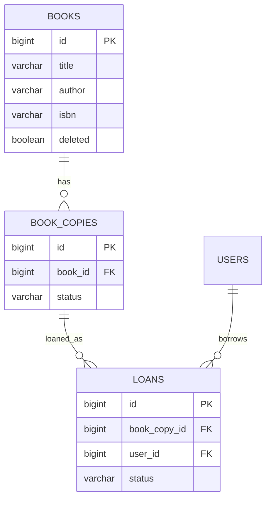
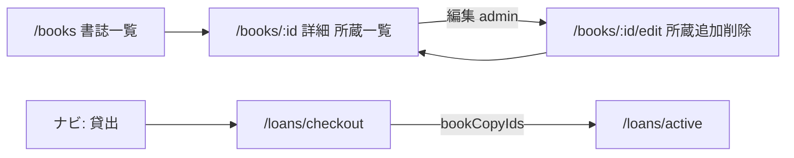

# 書誌 / 所蔵分離と一括貸出（checkout）設計変更案

| 項目 | 内容 |
|------|------|
| **対象** | **Member A**（DB / API / Security 境界）と **Member B**（SPA / 画面 / API クライアント）の双方 |
| **ステータス** | **確定**（2026-07-15）。設計 docs へ反映済み。実装は Member A / B が各自で行う |
| **目的** | [refact-plane.md](./refact-plane.md) を出発点に、現行設計の核を崩さず書誌・所蔵分離と一括貸出へ移行する合意文書 |
| **設計の正（併読）** | [er-diagram.md](./er-diagram.md) / [openapi-notes.md](./openapi-notes.md) / [screen-transition.md](./screen-transition.md) / [sequence-diagram.md](./sequence-diagram.md) / [README.md](../README.md) / [frontend-gap-analysis.md](./frontend-gap-analysis.md) |

**読み方**

- 全体方針・差分・成功条件 → A/B 共通
- 「3. 目標データモデル」・Flyway / Backend スケッチ → 主に A
- 「5. UI / ルート」・LoanProvider・Frontend スケッチ → 主に B
- 「6. API 契約（JSON 差分）」→ A（実装）と B（型・クライアント）の契約

---

## 1. 背景と結論

現在のアプリ想定は「蔵書詳細から利用者を選び 1 冊ずつ貸出」だが、司書向けバックオフィスでは複数冊一括貸出と、同一タイトル複数冊の区別が必要。あわせて書誌と所蔵を分離する。

Loan API は未実装のため、旧単件 F-04 を完成させて捨てるのではなく、**本モデルで F-04 を実装する**。

| 結論 | 内容 | A | B |
|------|------|---|---|
| データ | `books`（書誌）と `book_copies`（所蔵 1 冊）に分離 | Flyway・Entity | 型・表示 |
| 一覧 / 詳細 | 一覧＝書誌、詳細＝書誌 + 所蔵状態 | holdings API | カード / 詳細 UI |
| 貸出 | `/loans/checkout` に統一。`bookCopyIds` 一括 POST | Loan API | LoanProvider + 画面 |
| 通常詳細 | 貸出・返却ボタンなし（状態確認のみ） | — | BookDetail から貸出 UI 削除 |
| 返却 | `/loans/active` のまま | return / active API | 返却 UI 維持 |
| 見送り | `barcode` / `location` / `returnDate`（`due_at`） | カラム作らない | UI も作らない |

### refact-plane からの絞り込み

| refact-plane | 本案 |
|--------------|------|
| `barcode` / `location` | 見送り |
| `returnDate` | 見送り |
| 横断 copy チェック一覧 | 不採用（書誌カード → 詳細内で選択） |
| サーバ自動割当（冊数指定） | 不採用（選んだ `bookCopyIds` を検証） |
| LoanProvider | 採用（`useState` + 選択中サマリ常設） |

---

## 2. 崩さない核（現行どおり）

| 核 | 扱い |
|----|------|
| Keycloak 認証 + JWT RBAC | 変更なし |
| `general_user` は貸出対象のみ・SPA 不可 | 変更なし |
| 利用者 CRUD = `general_user` のみ（社員は Keycloak） | 変更なし（F-06 は別トラック可） |
| `/loans/active` + `GET /api/loans/active` | 維持 |
| `/loans/me` | 禁止のまま |
| `loans.status` = `BORROWED` / `RETURNED` | 維持（所蔵側だけ `AVAILABLE` / `LOANED`） |
| エラー `{ error, message }`・409 | 維持 |
| 論理削除 `books.deleted` / `users.is_active` | 維持 |

---

## 3. 目標データモデル



- `books.stock_count` **廃止**。貸出可能冊数 = `COUNT(book_copies WHERE book_id=? AND deleted=false AND status='AVAILABLE')`
- 貸出の紐付けは **`book_copies.id`**
- 所蔵削除は **論理削除（`book_copies.deleted=true`）**。`status` に `DELETED` は足さない
- `barcode` / `location` カラムは作らない

### Flyway 移行（Member A）

1. `book_copies` 作成（`id`, `book_id`, `status` CHECK `AVAILABLE|LOANED`）
2. 既存 `books` 各行について、旧 `stock_count` 件の `AVAILABLE` 行を投入
3. `loans.book_id` → `loans.book_copy_id`（既存貸出が無いか少ない前提）
4. `books.stock_count` 削除
5. （追補）`book_copies.deleted BOOLEAN NOT NULL DEFAULT false` を追加

---

## 4. 既存 docs との差分一覧

合意後に各ファイルを更新する。

### 4.1 [er-diagram.md](./er-diagram.md)

| 項目 | 現行 | 変更後 |
|------|------|--------|
| エンティティ | `BOOKS`—`LOANS`—`USERS` | `BOOKS`—`BOOK_COPIES`—`LOANS`—`USERS` |
| `books.stock_count` | あり | 削除（集計） |
| `loans` FK | `book_id` → books | `book_copy_id` → book_copies |
| 所蔵 status | なし | `AVAILABLE` / `LOANED` |
| `due_at` | 対象外 | 引き続き対象外 |

### 4.2 [openapi-notes.md](./openapi-notes.md)

→ **「6. API 契約」の JSON 差分が正の詳細**。要約のみ下記。

| 項目 | 現行 | 変更後 |
|------|------|--------|
| Book | `stockCount` | `totalCount` + `availableCount`（詳細は `holdings`） |
| 貸出 POST | `{ bookId, userId }` 単件 | `{ userId, bookCopyIds }` 一括 |
| 在庫 | `stock_count` 加減算 | copy status 更新 |
| 新規 | — | `POST /api/books/{id}/copies`（所蔵追加） |
| 新規 | — | `DELETE /api/books/{id}/copies/{copyId}`（所蔵削除・編集画面） |
| future の `/loans/batch` | 参考案 | 不採用 |

### 4.3 [screen-transition.md](./screen-transition.md)

| 項目 | 現行 | 変更後 |
|------|------|--------|
| `/books` | 蔵書一覧 | 書誌一覧 |
| `/books/:id` | 貸出・返却あり | **所蔵一覧テーブル表示**（閲覧のみ） |
| `/books/:id/edit` | 書誌更新・削除 | **所蔵追加/削除** + 書誌更新・書誌削除 |
| ナビ | 蔵書 / 利用者 / 貸出中 | **貸出（checkout）追加** |
| 新規 | — | `/loans/checkout/*` |
| 「詳細内で貸出完結」 | あり | 削除（checkout に統一） |

### 4.4 [sequence-diagram.md](./sequence-diagram.md)

| 項目 | 現行 | 変更後 |
|------|------|--------|
| 貸出 | 単件・stock 減算 | 複数 copy・同一 TX |
| 返却 | stock 加算 | copy → `AVAILABLE` |

### 4.5 [README.md](../README.md)

| 項目 | 現行 | 変更後 |
|------|------|--------|
| F-04 | 詳細 1 冊・`bookId` | checkout 一括・`bookCopyIds` |
| DB | `stock_count` | 書誌 / 所蔵分離 |

### 4.6 [future-considerations.md](./future-considerations.md)

| 項目 | 現行 | 変更後 |
|------|------|--------|
| 一括貸出は MVP-A 後 | 記載あり | 本案で F-04 に取り込み |
| `/loans/batch` + `bookIds` | 参考 | 不採用 |

### 4.7 [frontend-gap-analysis.md](./frontend-gap-analysis.md)

合意後、ルート・F-04・API・型の差分を本案に合わせて書き換え（Member B）。

### 4.8 [refact-plane.md](./refact-plane.md)

当初たたき台。合意の正は**本ファイル**。

---

## 5. UI / ルート（Member B 中心・A は契約理解用）



| パス | 役割 | 通常/checkout |
|------|------|----------------|
| `/books` | 書誌カード（所蔵数・貸出可能数） | 通常 |
| `/books/:id` | 書誌 + **所蔵一覧テーブル**（閲覧のみ） | 通常 |
| `/books/:id/edit` | 書誌フォーム + **所蔵の追加/削除**（admin） | 通常 |
| `/loans/checkout` | 利用者選択 | checkout |
| `/loans/checkout/books` | BookList 同型カード | checkout |
| `/loans/checkout/books/:id` | 詳細 + AVAILABLE 所蔵の複数選択 | checkout |
| `/loans/checkout/confirm` | 確認 → POST | checkout |
| `/loans/active` | 貸出中・返却 | 通常 |

### 貸出フロー

```text
利用者選択
  → 書誌カード一覧
  → 詳細で AVAILABLE 所蔵をチェック
  → LoanProvider に蓄積（別書誌も追加可）
  → 確認
  → POST { userId, bookCopyIds }
```

方針:

- 全所蔵の横断フラット列挙はしない
- 選択ソースは **LoanProvider の `useState` のみ**（`navigate` state / props リレーなし）
- checkout レイアウトに **選択中サマリ常設**
- localStorage 永続化は不要

### 選択中サマリの画面イメージ

**一覧 + サマリ**

```text
┌─────────────────────────────────────────────────────────────┐
│ 貸出 — 本を選ぶ                    利用者: 山田太郎          │
├──────────────────────────────┬──────────────────────────────┤
│ 書誌カード一覧               │ 選択中 (2)                   │
│ ┌──────────────────────────┐ │ ・Java入門  #12               │
│ │ Java入門                 │ │ ・Java入門  #15               │
│ │ 貸出可能 2 / 所蔵 3      │ │ [ 選択を解除 ]  [ 確認へ → ] │
│ └──────────────────────────┘ │                              │
└──────────────────────────────┴──────────────────────────────┘
```

**詳細（所蔵選択）+ サマリ**

```text
┌─────────────────────────────────────────────────────────────┐
│ ← 一覧へ   Java入門                                          │
├──────────────────────────────┬──────────────────────────────┤
│ 所蔵                         │ 選択中 (2)                   │
│ ☑ #12  AVAILABLE             │ ・Java入門  #12               │
│ ☐ #14  LOANED（選択不可）    │ ・Java入門  #15               │
│ ☑ #15  AVAILABLE             │         [ 確認へ → ]         │
└──────────────────────────────┴──────────────────────────────┘
```

**確認**

```text
┌──────────────────────────────────────┐
│ 貸出内容の確認                       │
│ 利用者: 山田太郎                     │
│ 1. Java入門  所蔵 #12                │
│ 2. Java入門  所蔵 #15                │
│ [ ← 選び直す ]      [ 貸出する ]     │
└──────────────────────────────────────┘
```

モバイルは下部シート想定。見た目の作り込みは F-10 にせず最小でよい。

### LoanProvider（Member B）

```tsx
type SelectedBookCopy = {
  bookCopyId: number
  bookId: number
  title: string
}

// LoanProvider 内
const [user, setUser] = useState<{ id: number; displayName: string } | null>(null)
const [selectedBookCopies, setSelectedBookCopies] = useState<SelectedBookCopy[]>([])

const addCopy = (c: SelectedBookCopy) => { /* 重複 id は無視 */ }
const removeCopy = (bookCopyId: number) => { /* filter */ }
const clearSelection = () => setSelectedBookCopies([])
```

| UI | 役割 |
|----|------|
| 選択中サマリ | 件数 + リスト。一覧・詳細のどちらでも表示 |
| 詳細チェック | オン `addCopy` / オフ `removeCopy` |
| 確認へ | `selectedBookCopies.length > 0` のときのみ |
| 確認画面 | 同じ state を POST。成功後 `clearSelection` |

### Frontend 型（変更後）

```ts
export type CopyStatus = 'AVAILABLE' | 'LOANED'

export type BookHolding = {
  id: number
  status: CopyStatus
}

export type Book = {
  id: number
  title: string
  author: string
  isbn: string
  totalCount: number
  availableCount: number
  holdings?: BookHolding[]
}
```

### ルートイメージ（Member B）

```tsx
<Route path="/loans/checkout" element={<LoanProvider><CheckoutLayout /></LoanProvider>}>
  <Route index element={<CheckoutUserSelectPage />} />
  <Route path="books" element={<CheckoutBookListPage />} />
  <Route path="books/:id" element={<CheckoutBookDetailPage />} />
  <Route path="confirm" element={<CheckoutConfirmPage />} />
</Route>
```

`CheckoutLayout` に `<Outlet />` と選択中サマリ。通常の `/books/:id` は `selectMode=false`（表示のみ）。

---

## 6. API 契約 — JSON 形式の差分

権限ロールは現行どおり（書誌 CRUD は `admin_employee`、貸出は社員以上）。エラー共通ボディも現行どおり。

```json
{
  "error": "ERROR_CODE",
  "message": "人間向け文言"
}
```

以下、各エンドポイントで **現行（openapi-notes 想定）→ 変更後** を示す。

---

### 6.1 GET /api/books（一覧）

**現行**

```json
[
  {
    "id": 1,
    "title": "リーダブルコード",
    "author": "Boswell",
    "isbn": "978-4-87311-565-8",
    "stockCount": 3
  }
]
```

**変更後**

```json
[
  {
    "id": 1,
    "title": "リーダブルコード",
    "author": "Boswell",
    "isbn": "978-4-87311-565-8",
    "totalCount": 3,
    "availableCount": 2
  }
]
```

| フィールド | 現行 | 変更後 |
|------------|------|--------|
| `stockCount` | 手入力・保持 | **廃止**（意味は `availableCount`） |
| `totalCount` | なし | 所蔵総数（AVAILABLE+LOANED、`deleted=false` のみ） |
| `availableCount` | なし | `deleted=false` かつ `status=AVAILABLE` の件数 |
| `holdings` | なし | 一覧では含めない（または空配列） |

---

### 6.2 GET /api/books/{id}（詳細）

**現行**

```json
{
  "id": 1,
  "title": "リーダブルコード",
  "author": "Boswell",
  "isbn": "978-4-87311-565-8",
  "stockCount": 3
}
```

**変更後**

```json
{
  "id": 1,
  "title": "リーダブルコード",
  "author": "Boswell",
  "isbn": "978-4-87311-565-8",
  "totalCount": 3,
  "availableCount": 2,
  "holdings": [
    { "id": 12, "status": "AVAILABLE" },
    { "id": 14, "status": "LOANED" },
    { "id": 15, "status": "AVAILABLE" }
  ]
}
```

| 差分 | 内容 |
|------|------|
| 追加 | `holdings[]`（`id` = `book_copies.id`） |
| 削除 | `stockCount` |
| 用途 | 通常詳細＝表示、checkout 詳細＝`AVAILABLE` のみ選択可 |

---

### 6.3 POST /api/books（書誌作成・admin）

**現行 Request**

```json
{
  "title": "リーダブルコード",
  "author": "Boswell",
  "isbn": "978-4-87311-565-8",
  "stockCount": 3
}
```

**現行 Response 201**

```json
{
  "id": 1,
  "title": "リーダブルコード",
  "author": "Boswell",
  "isbn": "978-4-87311-565-8",
  "stockCount": 3
}
```

**変更後 Request**

```json
{
  "title": "リーダブルコード",
  "author": "Boswell",
  "isbn": "978-4-87311-565-8",
  "initialCopyCount": 3
}
```

**変更後 Response 201**

```json
{
  "id": 1,
  "title": "リーダブルコード",
  "author": "Boswell",
  "isbn": "978-4-87311-565-8",
  "totalCount": 3,
  "availableCount": 3,
  "holdings": [
    { "id": 12, "status": "AVAILABLE" },
    { "id": 13, "status": "AVAILABLE" },
    { "id": 14, "status": "AVAILABLE" }
  ]
}
```

| 差分 | 内容 |
|------|------|
| Request | `stockCount` → `initialCopyCount`（1 以上。同数の AVAILABLE 行を作成） |
| Response | 詳細と同じ形（集計 + holdings） |

---

### 6.4 PUT /api/books/{id}（書誌更新・admin）

**現行 Request**

```json
{
  "title": "リーダブルコード 改訂版",
  "author": "Boswell",
  "isbn": "978-4-87311-565-8",
  "stockCount": 5
}
```

**変更後 Request**

```json
{
  "title": "リーダブルコード 改訂版",
  "author": "Boswell",
  "isbn": "978-4-87311-565-8"
}
```

| 差分 | 内容 |
|------|------|
| Request | **`stockCount` を受け付けない**（冊数変更は copies API） |
| Response | 詳細と同じ（`totalCount` / `availableCount` / `holdings`） |

冊数を増やす場合は次の「6.5 POST /api/books/{id}/copies」。

---

### 6.5 POST /api/books/{id}/copies（新規・admin）

所蔵を 1 冊追加する。書誌編集画面（`/books/:id/edit`）から呼ぶ。

**Request**

```json
{}
```

（ボディ空でよい。将来 barcode 等を足す余地はあるが今回はフィールドなし）

**Response 201**

```json
{
  "id": 16,
  "status": "AVAILABLE"
}
```

**エラー例 404**

```json
{
  "error": "BOOK_NOT_FOUND",
  "message": "書誌が見つかりません"
}
```

---

### 6.6 DELETE /api/books/{id}/copies/{copyId}（新規・admin）

所蔵を 1 冊 **論理削除**する（`book_copies.deleted=true`）。既存の `DELETE /api/books/{id}`（書誌論理削除）とは別。編集画面から呼ぶ。物理削除は行わない。

**Response 204**

```json
{}
```

**Response 409**

```json
{
  "error": "COPY_NOT_DELETABLE",
  "message": "貸出中の所蔵のため削除できません"
}
```

| 条件 | 結果 |
|------|------|
| `AVAILABLE`（過去 loans の有無は問わない） | 204（`deleted=true`） |
| `LOANED` | 409 |
| 所蔵なし / 書誌に属さない / 既に `deleted=true` | 404 |
| 所蔵一覧の再表示 | 既存 `GET /api/books/{id}` を再利用（未削除のみ） |

---

### 6.7 DELETE /api/books/{id}（論理削除・admin）

パス・204 は現行どおり。衝突条件を copy 基準に明確化。

**現行 Response 409 例**

```json
{
  "error": "BOOK_HAS_ACTIVE_LOANS",
  "message": "貸出中のため削除できません"
}
```

**変更後 Response 409 例（推奨）**

```json
{
  "error": "BOOK_HAS_LOANED_COPIES",
  "message": "貸出中の所蔵があるため削除できません"
}
```

処理: 当該書誌に `status=LOANED` の所蔵が 1 件でもあれば 409。なければ `books.deleted=true`。

---

### 6.8 POST /api/loans（F-04・一括）

**現行 Request**

```json
{
  "bookId": 1,
  "userId": 10
}
```

**現行 Response 201**

```json
{
  "id": 42,
  "bookId": 1,
  "userId": 10,
  "borrowedAt": "2026-06-30T10:00:00Z",
  "returnedAt": null,
  "status": "BORROWED"
}
```

**変更後 Request**

```json
{
  "userId": 10,
  "bookCopyIds": [12, 15]
}
```

**変更後 Response 201**

```json
{
  "loans": [
    {
      "id": 42,
      "bookCopyId": 12,
      "bookId": 1,
      "bookTitle": "リーダブルコード",
      "userId": 10,
      "borrowedAt": "2026-06-30T10:00:00Z",
      "returnedAt": null,
      "status": "BORROWED"
    },
    {
      "id": 43,
      "bookCopyId": 15,
      "bookId": 1,
      "bookTitle": "リーダブルコード",
      "userId": 10,
      "borrowedAt": "2026-06-30T10:00:00Z",
      "returnedAt": null,
      "status": "BORROWED"
    }
  ]
}
```

（`bookId` / `bookTitle` はレスポンス便宜上の付帯。永続 FK の正は `bookCopyId`。）

**変更後 Response 409 例**

```json
{
  "error": "COPY_NOT_AVAILABLE",
  "message": "貸出できない所蔵が含まれています",
  "failedBookCopyIds": [15]
}
```

| 差分 | 内容 |
|------|------|
| Request | `bookId` 単件 → `bookCopyIds` 配列 |
| Response | 単一オブジェクト → `loans` 配列（推奨） |
| TX | 全件成功 / 全件ロールバック |
| 処理 | 各 copy を FOR UPDATE → AVAILABLE 確認 → LOANED + loan BORROWED |

**サーバ自動割当はしない。** クライアントが選んだ id のみ。

---

### 6.9 PUT /api/loans/{id}/return

**現行 Response 200**

```json
{
  "id": 42,
  "bookId": 1,
  "userId": 10,
  "borrowedAt": "2026-06-30T10:00:00Z",
  "returnedAt": "2026-07-07T15:30:00Z",
  "status": "RETURNED"
}
```

**変更後 Response 200**

```json
{
  "id": 42,
  "bookCopyId": 12,
  "bookId": 1,
  "bookTitle": "リーダブルコード",
  "userId": 10,
  "borrowedAt": "2026-06-30T10:00:00Z",
  "returnedAt": "2026-07-07T15:30:00Z",
  "status": "RETURNED"
}
```

| 差分 | 内容 |
|------|------|
| フィールド | `bookId`（貸出対象の意味）→ 正は `bookCopyId`。書誌情報は付帯 |
| 副作用 | `stock_count++` → 当該 copy を `AVAILABLE` |
| 409 | 二重返却は現行どおり（例: `LOAN_ALREADY_RETURNED`） |

---

### 6.10 GET /api/loans/active

**現行 Response 200**

```json
[
  {
    "id": 42,
    "book": {
      "id": 1,
      "title": "リーダブルコード",
      "author": "Boswell"
    },
    "user": {
      "id": 10,
      "displayName": "山田 太郎"
    },
    "borrowedAt": "2026-06-30T10:00:00Z",
    "returnedAt": null,
    "status": "BORROWED"
  }
]
```

**変更後 Response 200**

```json
[
  {
    "id": 42,
    "bookCopyId": 12,
    "book": {
      "id": 1,
      "title": "リーダブルコード",
      "author": "Boswell"
    },
    "user": {
      "id": 10,
      "displayName": "山田 太郎"
    },
    "borrowedAt": "2026-06-30T10:00:00Z",
    "returnedAt": null,
    "status": "BORROWED"
  }
]
```

| 差分 | 内容 |
|------|------|
| 追加 | `bookCopyId` |
| `book` | 書誌（種類）の id / title / author。一覧表示用 |
| パス | 変更なし。`/api/loans/me` は引き続き対象外 |

---

### 6.11 変更しない API

利用者 CRUD（`/api/users`）、認証、エラー共通仕様の骨格は変更しない（F-06 独立）。

---

## 7. 実装フェーズと担当

| Phase | 内容 | A | B |
|-------|------|---|---|
| **0** | 設計 docs を本案に更新 | ○ | ○ |
| **1** | Flyway（book_copies / book_copy_id / stock_count 削除） | **主** | — |
| **2** | Book 集計・holdings・copies 追加/削除・Loan 一括/返却/active | **主** | 契約確認 |
| **3** | 書誌 UI（詳細=所蔵一覧、編集=所蔵追加削除）・checkout・LoanProvider | 契約固定 | **主** |
| **4** | admin：initialCopyCount・編集画面での所蔵追加/削除・書誌削除 409 | ○ | ○ |

推奨順: **0 → 1 → 2 → 3**（Loan 未実装のうちに切替）。F-06 は並行可。

---

## 8. 実装スケッチ

### 8.1 Backend（Member A）

```java
public enum CopyStatus { AVAILABLE, LOANED }

@Entity
@Table(name = "book_copies")
public class BookCopy {
    @Id @GeneratedValue(strategy = GenerationType.IDENTITY)
    private Long id;
    @Column(name = "book_id", nullable = false)
    private Long bookId;
    @Enumerated(EnumType.STRING)
    @Column(nullable = false, length = 16)
    private CopyStatus status;
    @Column(nullable = false)
    private boolean deleted = false;
}

// Loan: book_copy_id に置換
@Column(name = "book_copy_id", nullable = false)
private Long bookCopyId;
```

```java
public record CreateLoansRequest(Long userId, List<Long> bookCopyIds) {}

@Transactional
public List<Loan> createLoans(CreateLoansRequest req) {
    List<Loan> created = new ArrayList<>();
    for (Long copyId : req.bookCopyIds()) {
        BookCopy copy = bookCopyRepository.findByIdForUpdate(copyId)
            .orElseThrow(/* 404 */);
        if (copy.getStatus() != CopyStatus.AVAILABLE) {
            throw /* 409 */;
        }
        copy.setStatus(CopyStatus.LOANED);
        Loan loan = new Loan();
        loan.setBookCopyId(copyId);
        loan.setUserId(req.userId());
        loan.setStatus(LoanStatus.BORROWED);
        created.add(loanRepository.save(loan));
    }
    return created;
}
```

```java
@Query("SELECT c FROM BookCopy c WHERE c.id = :id")
@Lock(LockModeType.PESSIMISTIC_WRITE)
Optional<BookCopy> findByIdForUpdate(@Param("id") Long id);
```

書誌作成: `initialCopyCount` 件の AVAILABLE を insert。  
`POST .../copies`: AVAILABLE を 1 件。  
`DELETE .../copies/{copyId}`: `AVAILABLE` なら `deleted=true`（履歴があっても可）。`LOANED` は 409。  
書誌論理削除: 未削除所蔵のうち `count(LOANED)>0` なら 409。  
集計・holdings・貸出対象: `deleted=false` のみ。

### 8.2 Frontend（Member B）

```ts
// api/loans.ts
export async function createLoans(userId: number, bookCopyIds: number[]) {
  const { data } = await apiClient.post('/loans', { userId, bookCopyIds })
  return data
}
```

```tsx
// checkout 詳細の所蔵（selectMode=true）
<input
  type="checkbox"
  checked={selected}
  disabled={holding.status !== 'AVAILABLE'}
  onChange={(e) => e.target.checked
    ? addCopy({ bookCopyId: holding.id, bookId: book.id, title: book.title })
    : removeCopy(holding.id)}
/>
```

`StockBadge` 等は `availableCount`（必要なら `totalCount`）を表示。mock も holdings 付きに更新。

---

## 9. やらないこと

- `books` と所蔵の 1 テーブル統合
- `barcode` / `location`
- `returnDate` / `due_at` / 延滞
- 通常詳細からの貸出（二重フロー）
- 全所蔵横断のフラット選択一覧
- 書誌+冊数 UI とサーバ自動割当
- `/loans/me`、社員のアプリ管理
- `POST /api/loans/batch`（future 案）

---

## 10. リスクと緩和

| リスク | 緩和 |
|--------|------|
| 既存 FE/BE の `stockCount` | 意味を available 集計へ。B は型と表示を同時更新 |
| 同時貸出の競合 | TX + FOR UPDATE。不足は 409 |
| 所蔵行が詳細内で似て見える | 1 書誌内のみ。表示は `#id` + status。barcode は将来 |
| status 名の混同 | loan=`BORROWED`、copy=`LOANED` を docs / 型で固定 |
| スコープ肥大 | Phase 0 合意後に 1→2→3。F-06 分離 |

---

## 11. 成功条件とレビュー依頼（A/B 双方）

### 成功条件

- [ ] 書誌と所蔵がテーブル分離されている（A）
- [ ] `POST /api/loans` が `bookCopyIds` 一括・TX 保証（A）
- [ ] 返却で copy が `AVAILABLE` に戻る（A）
- [ ] `/loans/active` が使える・`bookCopyId` が分かる（A/B）
- [ ] 一覧は書誌、詳細で所蔵状態が見える（B）
- [ ] checkout がカード→詳細選択→サマリ→確認で動く（B）
- [ ] 通常詳細に貸出ボタンがない（B）
- [ ] 認証・利用者モデルが変わっていない（A/B）
- [ ] 設計 docs が本案に更新されている（Phase 0）

### Member A への確認

1. 「3. 目標データモデル」の ER / Flyway でよいか  
2. 「6. API 契約」の JSON（特に loans 一括と Book の `totalCount`/`availableCount`）でよいか  
3. PUT books から冊数フィールドを外す方針でよいか  

### Member B への確認

1. 「5. UI / ルート」のルート・サマリ・LoanProvider でよいか  
2. `stockCount` → `availableCount` / `totalCount` / `holdings` の型変更でよいか  
3. 通常詳細から貸出削除・checkout への統一でよいか  

設計 docs（Phase 0）は本確定内容で更新済みです。実装は Phase 1 以降を Member A / B が各自で進めてください。
