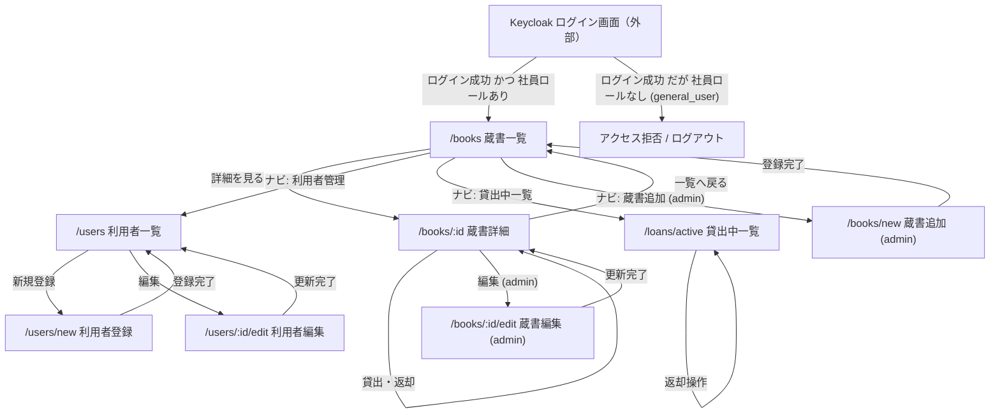

# 画面遷移図

このドキュメントは、LibraShare フロントエンド（React SPA）の画面遷移を示す設計図です。react-router によるクライアントサイドルーティングを前提とし、現行の 3 ロール設計に合わせています。参考モックは [my-react-app](/home/spiritualmasa/workspace/react-handson/my-react-app) です。

## 前提

- SPA（クライアントサイドルーティング）。画面遷移はページ再読み込みを伴いません。
- バックオフィス画面を操作するのは `general_employee` / `admin_employee` です。`general_user`（利用者）は貸出対象で、画面操作の対象外です。
- アプリの画面・API で作成・編集する対象は利用者（`general_user`）のみです。社員・管理社員は Keycloak 管理コンソールで管理し、アプリからは作成・編集しません。
- 認証は Keycloak。未ログイン時は **Keycloak のログイン画面（外部）**へ誘導します（Protected Route 前提。F-01）。SPA に `/login` ルートは設けず、`keycloak.login()` により外部ログイン画面へ遷移します。
- 認証（Keycloak ログイン）と認可（SPA 利用）は分離します。`general_user` はアカウントを持つため認証は通りますが、社員ロール（`general_employee` / `admin_employee`）が無いため保護ルートにはアクセスできず、権限エラー画面またはログアウトへ誘導します。
- モックの `/loans/me`（マイ貸出）は現行設計では廃止し、`/loans/active`（貸出中一覧）に置き換えます。

## ルート一覧

| パス | 画面 | 権限 | 主な操作 |
|------|------|------|----------|
| （外部）Keycloak ログイン画面 | ログイン | 認証は全員可 / SPA 利用は一般社員以上 | SPA から `keycloak.login()` で遷移。社員ロール無しは弾く |
| `/books` | 蔵書一覧 | 一般社員以上 | 詳細へ遷移、蔵書追加（管理社員） |
| `/books/:id` | 蔵書詳細 | 一般社員以上 | 貸出・返却、編集・削除（管理社員） |
| `/books/new` | 蔵書追加 | 管理社員のみ | 蔵書登録 |
| `/books/:id/edit` | 蔵書編集 | 管理社員のみ | 蔵書更新 |
| `/users` | 利用者一覧 | 一般社員以上 | 登録・編集へ遷移（対象は利用者のみ） |
| `/users/new` | 利用者登録 | 一般社員以上 | 利用者登録（ロールは `general_user` 固定） |
| `/users/:id/edit` | 利用者編集 | 一般社員以上 | 利用者更新・論理削除 |
| `/loans/active` | 貸出中一覧 | 一般社員以上 | 貸出中の利用者把握、返却操作 |

初期表示（`/`）は `/books` へリダイレクトします（モックの `index` 挙動を踏襲）。

## ヘッダーナビ（Layout）

モックの共通 `Layout` を踏襲し、ロールに応じて表示を切り替えます。

| ロール | ナビ表示 |
|--------|----------|
| 一般社員 | 蔵書一覧 / 利用者管理 / 貸出中一覧 / ログアウト |
| 管理社員 | 蔵書一覧 / 利用者管理 / 貸出中一覧 / 蔵書追加 / ログアウト |

管理社員向けの蔵書更新・削除は、蔵書一覧・詳細内の管理操作として表示します。

## 画面遷移図

## 補足

- 未ログイン状態で保護ルートにアクセスした場合は、`keycloak.login()` により Keycloak のログイン画面（外部）へ誘導します。
- `general_user` は Keycloak 認証は通りますが、社員ロールを持たないため保護ルートで弾かれ、権限エラー画面またはログアウトへ誘導します（認証と認可の分離）。SPA 側の Protected Route と API 側の RBAC の双方で拒否します。
- 貸出・返却は蔵書詳細（および貸出中一覧）内のボタン操作で完結し、画面遷移を伴いません。在庫数・状態は画面内で更新します。
- 利用者の論理削除は `/users/:id/edit` 内の削除操作で行い、貸出中がある場合は削除不可（`409`）として画面内でエラー表示します。
- 利用者管理の対象は `general_user` のみです。社員・管理社員は Keycloak 管理コンソールで管理し、アプリの画面・API からは作成・編集しません。
- 蔵書追加・更新・削除、利用者管理の操作可否は Keycloak のロール（JWT）に基づき、フロントのナビ表示と API 側の RBAC の双方で制御します。

## 関連ドキュメント

- [README.md](README.md) — 機能一覧、ロール、API エンドポイント
- [docs/sequence-diagram.md](docs/sequence-diagram.md) — 全体シーケンス図
- [docs/er-diagram.md](docs/er-diagram.md) — ER 図
- [docs/openapi-notes.md](docs/openapi-notes.md) — API 補足メモ
