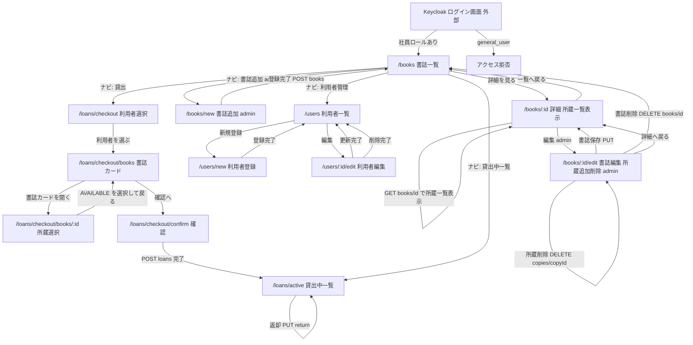

# 画面遷移図

このドキュメントは、LibraShare フロントエンド（React SPA）の画面遷移を示す設計図です。react-router によるクライアントサイドルーティングを前提とし、現行の 3 ロール設計に合わせています。

書誌 / 所蔵分離と一括貸出（checkout）の確定方針は [refactor-holdings-and-checkout.md](./refactor-holdings-and-checkout.md) を参照してください。

## 前提

- SPA（クライアントサイドルーティング）。画面遷移はページ再読み込みを伴いません。
- バックオフィス画面を操作するのは `general_employee` / `admin_employee` です。`general_user`（利用者）は貸出対象で、画面操作の対象外です。
- アプリの画面・API で作成・編集する対象は利用者（`general_user`）のみです。社員・管理社員は Keycloak 管理コンソールで管理し、アプリからは作成・編集しません。
- 認証は Keycloak。未ログイン時は **Keycloak のログイン画面（外部）**へ誘導します（Protected Route 前提。F-01）。SPA に `/login` ルートは設けず、`keycloak.login()` により外部ログイン画面へ遷移します。
- 認証（Keycloak ログイン）と認可（SPA 利用）は分離します。`general_user` はアカウントを持つため認証は通りますが、社員ロールが無いため保護ルートにはアクセスできず、権限エラー画面またはログアウトへ誘導します。
- `/loans/me`（マイ貸出）は廃止し、貸出中一覧は `/loans/active` です。
- 一覧は**書誌**、詳細は書誌 + **所蔵一覧（閲覧）**です。所蔵の追加・削除は**編集画面**で行います。貸出は `/loans/checkout` に統一します（詳細から貸出・所蔵操作をしない）。

## ルート一覧

| パス | 画面構成（具体） | 権限 | 利用 API |
|------|------------------|------|----------|
| （外部）Keycloak ログイン | ログイン | 認証は全員可 / SPA は社員以上 | `keycloak.login()` |
| `/books` | 書誌カード一覧（所蔵数・貸出可能数） | 一般社員以上 | `GET /api/books` |
| `/books/:id` | 書誌情報 + **所蔵一覧テーブル**（copy id / status）。admin は「編集へ」。貸出・返却・所蔵の追加削除は置かない | 一般社員以上 | `GET /api/books/{id}` |
| `/books/new` | 書誌登録フォーム（`initialCopyCount`） | 管理社員のみ | `POST /api/books` |
| `/books/:id/edit` | 書誌フォーム + **所蔵管理**（一覧・追加・AVAILABLE のみ削除）+ 書誌論理削除 | 管理社員のみ | `GET` → `PUT` / `POST .../copies` / `DELETE .../copies/{copyId}` / `DELETE /api/books/{id}` |
| `/users` | 利用者カード一覧 | 一般社員以上 | `GET /api/users` |
| `/users/new` | 氏名・メール登録 | 一般社員以上 | `POST /api/users` |
| `/users/:id/edit` | 利用者更新・論理削除 | 一般社員以上 | `PUT` / `DELETE /api/users/{id}` |
| `/loans/checkout` | 貸出先利用者を選択 | 一般社員以上 | `GET /api/users` |
| `/loans/checkout/books` | 書誌カード + 選択中サマリ | 一般社員以上 | `GET /api/books` |
| `/loans/checkout/books/:id` | AVAILABLE 所蔵の複数選択 + サマリ | 一般社員以上 | `GET /api/books/{id}` |
| `/loans/checkout/confirm` | 貸出内容確認 → 一括 POST | 一般社員以上 | `POST /api/loans` |
| `/loans/active` | 貸出中一覧・返却 | 一般社員以上 | `GET /api/loans/active` / `PUT .../return` |

初期表示（`/`）は `/books` へリダイレクトします。所蔵専用の別ルート（例: `/books/:id/copies`）は設けません。

## ヘッダーナビ（Layout）

| ロール | ナビ表示 |
|--------|----------|
| 一般社員 | 書誌一覧 / 貸出 / 貸出中一覧 / 利用者管理 / ログアウト |
| 管理社員 | 書誌一覧 / 貸出 / 貸出中一覧 / 利用者管理 / 書誌追加 / ログアウト |

管理社員向けの書誌更新・所蔵追加削除・書誌削除は `/books/:id/edit` で行う。削除専用ルートは設けない。

## 画面イメージ

### 書誌詳細 `/books/:id`（所蔵は閲覧のみ）

```text
書誌: Java入門 / 著者 A / ISBN …
所蔵数 3 / 貸出可能 2

所蔵一覧
  #12  AVAILABLE
  #14  LOANED
  #15  AVAILABLE

[編集]（admin のみ）    [一覧へ]
```

- データ取得: `GET /api/books/{id}` の `holdings` をそのまま表示する（所蔵専用 GET は使わない）。
- 所蔵の追加・削除ボタンは置かない（編集画面へ誘導）。

### 書誌編集 `/books/:id/edit`（admin・所蔵の追加削除）

```text
書誌フォーム
  title / author / isbn          [書誌を保存]

所蔵管理
  #12  AVAILABLE                 [削除]
  #14  LOANED                    （削除不可）
  #15  AVAILABLE                 [削除]
  [所蔵を1冊追加]

[書誌を削除]                     [詳細へ戻る]
```

| 操作 | API | 備考 |
|------|-----|------|
| 初期表示 | `GET /api/books/{id}` | 書誌 + holdings |
| 書誌保存 | `PUT /api/books/{id}` | title / author / isbn のみ |
| 所蔵追加 | `POST /api/books/{id}/copies` | 成功後同一画面で holdings を再取得 |
| 所蔵削除 | `DELETE /api/books/{id}/copies/{copyId}` | `AVAILABLE` のみ。`LOANED` や履歴制約は 409 |
| 書誌削除 | `DELETE /api/books/{id}` | 貸出中所蔵があれば 409。成功後 `/books` |

書誌に AVAILABLE が 0 冊でも書誌行は残せる（あとから所蔵追加で復旧可能）。

## 画面遷移図



## 補足

- 未ログインで保護ルートにアクセスした場合は `keycloak.login()` で Keycloak へ誘導します。
- `general_user` は社員ロールが無いため保護ルートで弾きます（認証と認可の分離）。
- **書誌詳細**は所蔵一覧の正の閲覧画面です。**書誌編集**が所蔵の追加・削除と書誌更新・書誌削除の操作点です。
- **貸出は checkout フローに統一**します。返却は `/loans/active` のみです。
- checkout 中の選択は `LoanProvider`（Context + `useState`）で保持し、選択中サマリを常設します。
- `LOANED` の所蔵は削除不可です。409 の `{ error, message }` を画面に表示します。
- 利用者管理の対象は `general_user` のみです。

## 関連ドキュメント

- [README.md](../README.md) — 機能一覧、ロール、API エンドポイント
- [refactor-holdings-and-checkout.md](./refactor-holdings-and-checkout.md) — 書誌/所蔵・checkout 確定設計
- [openapi-notes.md](./openapi-notes.md) — API 補足メモ
- [sequence-diagram.md](./sequence-diagram.md) — 全体シーケンス図
- [er-diagram.md](./er-diagram.md) — ER 図
