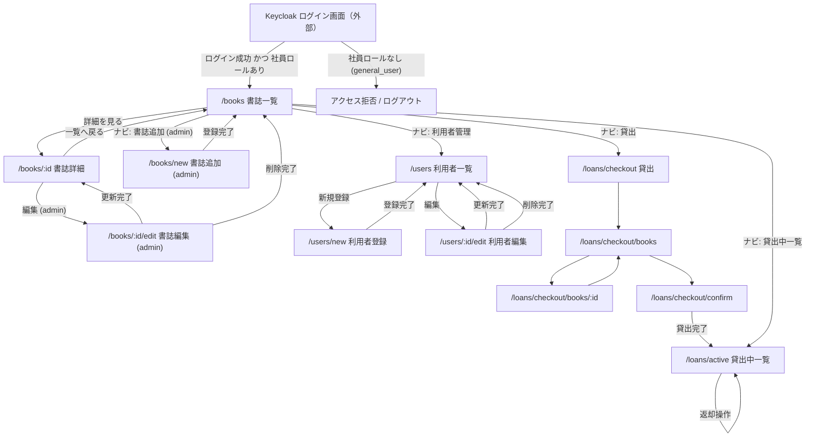

# 画面遷移図

このドキュメントは、LibraShare フロントエンド（React SPA）の画面遷移を示す設計図です。react-router によるクライアントサイドルーティングを前提とし、現行の 3 ロール設計に合わせています。

書誌 / 所蔵分離と一括貸出（checkout）の確定方針は [refactor-holdings-and-checkout.md](./refactor-holdings-and-checkout.md) を参照してください。

## 前提

- SPA（クライアントサイドルーティング）。画面遷移はページ再読み込みを伴いません。
- バックオフィス画面を操作するのは `general_employee` / `admin_employee` です。`general_user`（利用者）は貸出対象で、画面操作の対象外です。
- アプリの画面・API で作成・編集する対象は利用者（`general_user`）のみです。社員・管理社員は Keycloak 管理コンソールで管理し、アプリからは作成・編集しません。
- 認証は Keycloak。未ログイン時は **Keycloak のログイン画面（外部）**へ誘導します（Protected Route 前提。F-01）。SPA に `/login` ルートは設けず、`keycloak.login()` により外部ログイン画面へ遷移します。
- 認証（Keycloak ログイン）と認可（SPA 利用）は分離します。`general_user` はアカウントを持つため認証は通りますが、社員ロールが無いため保護ルートにはアクセスできず、権限エラー画面またはログアウトへ誘導します。
- `/loans/me`（マイ貸出）は廃止し、貸出中一覧は `/loans/active` です。
- 一覧は**書誌**、詳細は書誌 + **所蔵状態**です。貸出は `/loans/checkout` に統一します（通常の書誌詳細から貸出しない）。

## ルート一覧

| パス | 画面 | 権限 | 主な操作 |
|------|------|------|----------|
| （外部）Keycloak ログイン画面 | ログイン | 認証は全員可 / SPA 利用は一般社員以上 | SPA から `keycloak.login()` で遷移 |
| `/books` | 書誌一覧 | 一般社員以上 | 詳細へ遷移、書誌追加（管理社員） |
| `/books/:id` | 書誌詳細 | 一般社員以上 | 所蔵状態の表示、編集（管理社員）。**貸出・返却なし** |
| `/books/new` | 書誌追加 | 管理社員のみ | 書誌登録（初回所蔵冊数つき） |
| `/books/:id/edit` | 書誌編集 | 管理社員のみ | 書誌更新・論理削除・所蔵追加 |
| `/users` | 利用者一覧 | 一般社員以上 | 登録・編集へ遷移 |
| `/users/new` | 利用者登録 | 一般社員以上 | 氏名・メールのみ登録 |
| `/users/:id/edit` | 利用者編集 | 一般社員以上 | 利用者更新・論理削除 |
| `/loans/checkout` | 貸出（利用者選択） | 一般社員以上 | 貸出先利用者を選択 |
| `/loans/checkout/books` | 貸出（書誌選択） | 一般社員以上 | BookList 同型カード。選択中サマリ併記 |
| `/loans/checkout/books/:id` | 貸出（所蔵選択） | 一般社員以上 | AVAILABLE 所蔵を複数選択 |
| `/loans/checkout/confirm` | 貸出確認 | 一般社員以上 | 確認後 `POST /api/loans` |
| `/loans/active` | 貸出中一覧 | 一般社員以上 | 貸出中の把握、返却操作 |

初期表示（`/`）は `/books` へリダイレクトします。

## ヘッダーナビ（Layout）

| ロール | ナビ表示 |
|--------|----------|
| 一般社員 | 書誌一覧 / 貸出 / 貸出中一覧 / 利用者管理 / ログアウト |
| 管理社員 | 書誌一覧 / 貸出 / 貸出中一覧 / 利用者管理 / 書誌追加 / ログアウト |

管理社員向けの書誌更新・削除は `/books/:id/edit` で行う。削除専用ルートは設けない。

## 画面遷移図

## 補足

- 未ログインで保護ルートにアクセスした場合は `keycloak.login()` で Keycloak へ誘導します。
- `general_user` は社員ロールが無いため保護ルートで弾きます（認証と認可の分離）。
- **貸出は checkout フローに統一**します。通常の `/books/:id` では所蔵の状態表示のみ行い、貸出・返却ボタンは置きません。返却は `/loans/active` で行います。
- checkout 中の選択は `LoanProvider`（Context + `useState`）で保持し、選択中サマリを常設します。`navigate` の state や props での受け渡しはしません。
- 利用者登録（`/users/new`）は氏名・メールのみです。初回パスワードは API が生成し Keycloak へ temporary で設定します。
- 書誌の論理削除（`books.deleted=true`）は貸出中所蔵（`LOANED`）がある場合は `409` です。
- 利用者管理の対象は `general_user` のみです。

## 関連ドキュメント

- [README.md](../README.md) — 機能一覧、ロール、API エンドポイント
- [refactor-holdings-and-checkout.md](./refactor-holdings-and-checkout.md) — 書誌/所蔵・checkout 確定設計
- [sequence-diagram.md](./sequence-diagram.md) — 全体シーケンス図
- [er-diagram.md](./er-diagram.md) — ER 図
- [openapi-notes.md](./openapi-notes.md) — API 補足メモ
