# 全体シーケンス図

このドキュメントは、LibraShare の MVP-A における主要フローを俯瞰するための設計用シーケンス図です。現時点では実装済みコードではなく、`README.md` と `docs/openapi-notes.md` に定義された予定仕様を元にしています。

## 対象範囲

- Keycloak ログインと JWT 取得
- Spring Boot API への Bearer JWT 付きリクエスト
- 蔵書一覧・詳細の参照
- 管理社員による蔵書追加・更新・削除
- 一般社員以上による利用者登録・更新・削除（対象は利用者のみ）
- 書籍の貸出・返却と在庫連動
- 貸出中一覧での利用者把握

MVP-B の検索・ページング、将来検討の延滞バッチはメインの図には含めません。

## 参加者

| 参加者 | 役割 |
|--------|------|
| Employee | 一般社員または管理社員 |
| ReactSPA | React + TypeScript + Vite のフロントエンド |
| Keycloak | OIDC 認証基盤 |
| KeycloakAdmin | Keycloak Admin API |
| SpringAPI | Spring Boot REST API / OAuth2 Resource Server |
| PostgreSQL | `books` / `users` / `loans` を保持する DB |

## ロール

| ロール | 利用できる主な機能 |
|--------|--------------------|
| `general_user` | 貸出対象の利用者。バックオフィス画面の操作は対象外（Keycloak + アプリ DB で管理） |
| `general_employee` | 蔵書一覧・詳細、利用者管理、貸出、返却、貸出中一覧（Keycloak コンソールで管理） |
| `admin_employee` | 一般社員の機能 + 蔵書追加・更新・削除（Keycloak コンソールで管理） |

## 全体シーケンス

```mermaid
sequenceDiagram
    actor Employee
    participant ReactSPA
    participant Keycloak
    participant KeycloakAdmin
    participant SpringAPI
    participant PostgreSQL

    Employee->>ReactSPA: アプリへアクセス
    ReactSPA->>Keycloak: ログイン画面へリダイレクト
    Employee->>Keycloak: 認証情報を入力
    Keycloak-->>ReactSPA: 認可コードを返却
    ReactSPA->>Keycloak: 認可コードを access_token に交換
    Keycloak-->>ReactSPA: access_token とロール情報を返却
    ReactSPA-->>Employee: ロールに応じたヘッダーを表示

    note over ReactSPA,SpringAPI: 以降の API 呼び出しは Authorization: Bearer access_token を付与する
    ReactSPA->>SpringAPI: GET /api/books
    SpringAPI->>Keycloak: JWT 署名検証用の公開鍵・メタデータを取得
    Keycloak-->>SpringAPI: 検証用メタデータ
    SpringAPI->>SpringAPI: JWT とロールを検証
    SpringAPI->>PostgreSQL: books を検索
    PostgreSQL-->>SpringAPI: 蔵書一覧
    SpringAPI-->>ReactSPA: 200 OK Book[]
    ReactSPA-->>Employee: 蔵書一覧を表示

    opt 蔵書詳細を表示
        Employee->>ReactSPA: 蔵書を選択
        ReactSPA->>SpringAPI: GET /api/books/{id}
        SpringAPI->>SpringAPI: JWT とロールを検証
        SpringAPI->>PostgreSQL: books を id で検索
        PostgreSQL-->>SpringAPI: 蔵書詳細
        SpringAPI-->>ReactSPA: 200 OK Book
        ReactSPA-->>Employee: 蔵書詳細を表示
    end

    alt 管理社員 admin_employee
        Employee->>ReactSPA: 蔵書追加・更新・削除を操作
        ReactSPA->>SpringAPI: POST /api/books または PUT /api/books/{id} または DELETE /api/books/{id}
        SpringAPI->>SpringAPI: JWT と admin_employee ロールを検証
        SpringAPI->>PostgreSQL: books を追加・更新・削除
        PostgreSQL-->>SpringAPI: 更新結果
        SpringAPI-->>ReactSPA: 201 Created または 200 OK または 204 No Content
        ReactSPA-->>Employee: 管理操作の結果を表示
    else 一般社員 general_employee
        Employee->>ReactSPA: 管理操作へアクセス
        ReactSPA-->>Employee: 管理メニューを表示しない
        opt API に直接アクセスされた場合
            ReactSPA->>SpringAPI: POST /api/books など
            SpringAPI->>SpringAPI: admin_employee ロール不足を検出
            SpringAPI-->>ReactSPA: 403 Forbidden
            ReactSPA-->>Employee: 権限エラーを表示
        end
    end

    opt 利用者を登録・更新・削除する（対象は general_user のみ）
        Employee->>ReactSPA: 利用者管理を操作
        ReactSPA->>SpringAPI: POST /api/users または PUT /api/users/{id} または DELETE /api/users/{id}
        SpringAPI->>SpringAPI: JWT と general_employee 以上のロールを検証
        alt 利用者登録
            SpringAPI->>KeycloakAdmin: 利用者作成と general_user ロール付与
            KeycloakAdmin-->>SpringAPI: Keycloak user id
            SpringAPI->>PostgreSQL: users に keycloak_sub と表示情報を保存
            PostgreSQL-->>SpringAPI: 登録結果
            SpringAPI-->>ReactSPA: 201 Created User
        else 利用者更新
            SpringAPI->>KeycloakAdmin: 利用者属性を更新
            KeycloakAdmin-->>SpringAPI: 更新結果
            SpringAPI->>PostgreSQL: users の表示情報を更新
            PostgreSQL-->>SpringAPI: 更新結果
            SpringAPI-->>ReactSPA: 200 OK User
        else 利用者削除（論理削除）
            SpringAPI->>PostgreSQL: 貸出中 loans の有無を確認
            PostgreSQL-->>SpringAPI: 確認結果
            alt 貸出中なし
                SpringAPI->>KeycloakAdmin: 利用者を無効化 enabled=false
                KeycloakAdmin-->>SpringAPI: 無効化結果
                SpringAPI->>PostgreSQL: users を論理削除 is_active=false 設定
                PostgreSQL-->>SpringAPI: 更新結果
                SpringAPI-->>ReactSPA: 204 No Content
            else 貸出中あり
                SpringAPI-->>ReactSPA: 409 Conflict
            end
        end
        ReactSPA-->>Employee: 利用者管理の結果を表示
    end

    opt 書籍を借りる
        Employee->>ReactSPA: 貸出対象の利用者と書籍を選択
        ReactSPA->>SpringAPI: POST /api/loans body: { bookId, userId }
        SpringAPI->>SpringAPI: JWT と利用可能ロールを検証
        SpringAPI->>PostgreSQL: users を userId で検索
        PostgreSQL-->>SpringAPI: 貸出対象の利用者
        SpringAPI->>PostgreSQL: books.stock_count を確認
        PostgreSQL-->>SpringAPI: 在庫数
        SpringAPI->>PostgreSQL: loans を作成 status=BORROWED
        SpringAPI->>PostgreSQL: books.stock_count を 1 減算
        PostgreSQL-->>SpringAPI: 貸出結果
        SpringAPI-->>ReactSPA: 201 Created Loan
        ReactSPA-->>Employee: 貸出完了と在庫数を反映
    end

    opt 書籍を返却する
        Employee->>ReactSPA: 返すボタンを押す
        ReactSPA->>SpringAPI: PUT /api/loans/{id}/return
        SpringAPI->>SpringAPI: JWT と利用可能ロールを検証
        SpringAPI->>PostgreSQL: loans.returned_at と status を更新
        SpringAPI->>PostgreSQL: books.stock_count を 1 加算
        PostgreSQL-->>SpringAPI: 返却結果
        SpringAPI-->>ReactSPA: 200 OK Loan
        ReactSPA-->>Employee: 返却完了と在庫数を反映
    end

    opt 貸出中の利用者を確認する
        Employee->>ReactSPA: 貸出中一覧を開く
        ReactSPA->>SpringAPI: GET /api/loans/active
        SpringAPI->>SpringAPI: JWT と general_employee 以上のロールを検証
        SpringAPI->>PostgreSQL: BORROWED loans を users と books つきで検索
        PostgreSQL-->>SpringAPI: 貸出中一覧と利用者情報
        SpringAPI-->>ReactSPA: 200 OK Loan[]
        ReactSPA-->>Employee: 貸出中の利用者を表示
    end
```

## API 対応表

| フロー | API | 権限 |
|--------|-----|------|
| 蔵書一覧 | `GET /api/books` | `general_employee` / `admin_employee` |
| 蔵書詳細 | `GET /api/books/{id}` | `general_employee` / `admin_employee` |
| 蔵書追加 | `POST /api/books` | `admin_employee` |
| 蔵書更新 | `PUT /api/books/{id}` | `admin_employee` |
| 蔵書削除 | `DELETE /api/books/{id}` | `admin_employee` |
| 利用者一覧 | `GET /api/users` | `general_employee` / `admin_employee` |
| 利用者詳細 | `GET /api/users/{id}` | `general_employee` / `admin_employee` |
| 利用者登録 | `POST /api/users` | `general_employee` / `admin_employee` |
| 利用者更新 | `PUT /api/users/{id}` | `general_employee` / `admin_employee` |
| 利用者削除 | `DELETE /api/users/{id}` | `general_employee` / `admin_employee` |
| 貸出 | `POST /api/loans` | `general_employee` / `admin_employee` |
| 返却 | `PUT /api/loans/{id}/return` | `general_employee` / `admin_employee` |
| 貸出中一覧 | `GET /api/loans/active` | `general_employee` / `admin_employee` |

## 補足

- Spring Boot API は OAuth2 Resource Server として JWT を検証し、ロールに応じて API アクセスを制御します。
- React SPA は Keycloak から取得した `access_token` を `Authorization: Bearer` ヘッダーに設定して API を呼び出します。
- 利用者管理の対象は `general_user` のみです。社員・管理社員は Keycloak コンソールで管理し、アプリの API・画面からは作成・編集しません。
- 利用者管理では Keycloak Admin API を呼び出し、Keycloak 側の利用者とアプリ DB の `users.keycloak_sub` を対応させます。付与ロールは常に `general_user` のため `users` に `role` は持ちません。
- 利用者削除は論理削除で行い、Keycloak 側は `enabled=false`、アプリ DB は `is_active=false` を設定します。過去の `loans` 履歴は保持します。
- 貸出では `loans` の作成と `books.stock_count` の減算を同じ業務処理として扱います。
- 返却では `loans.returned_at` と `loans.status` の更新、`books.stock_count` の加算を同じ業務処理として扱います。
- 利用者自身が操作する `GET /api/loans/me` のようなマイ貸出機能は MVP-A の対象外です。
